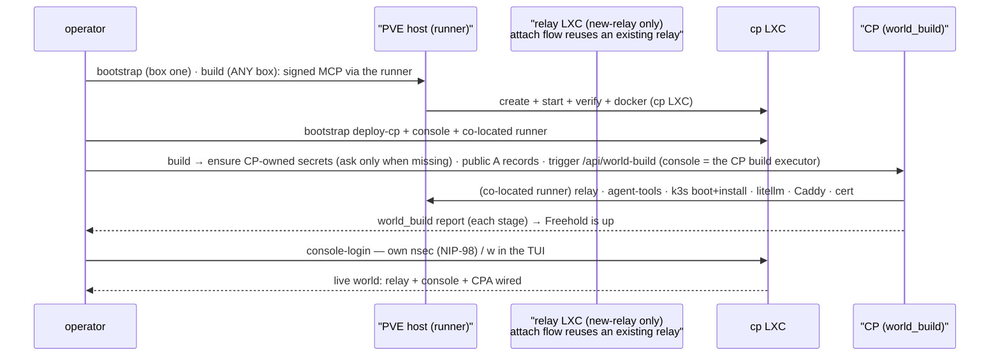
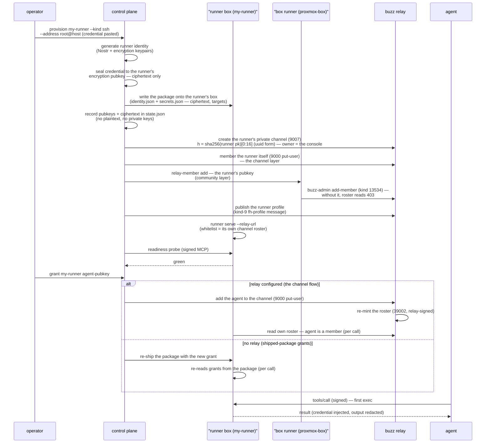
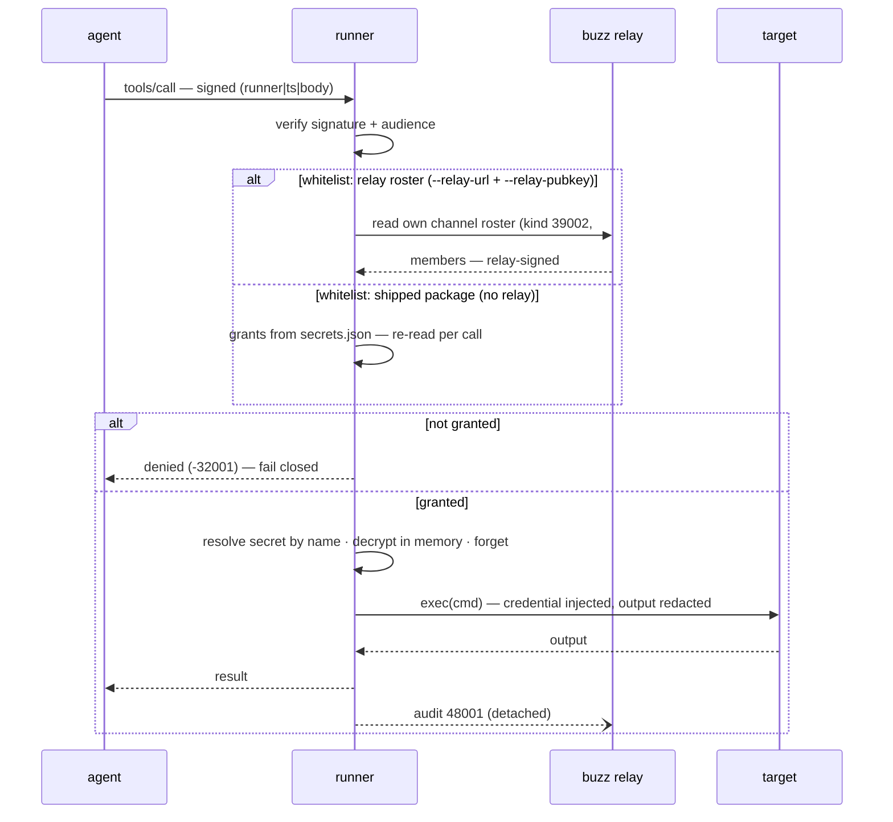

# freehold

*Reclaim the future we were promised.* An open-source appliance — one-command install,
AI-agent-operated — that lands a Proxmox VE / VPS + Kubernetes stack with Buzz Relay as the
control plane and a skill framework that installs and configures self-hosted OSS. The agent
is the wall-breaker: you don't manage servers, you *ask*.

The current version is the top entry in `CHANGELOG.md` (never restated here). That file
also records the history of how this plan got here.

**Status:** the engine room (identity, secret provisioner, MCP runner primitive, SSH/Vultr/
B2 connectors, coarse grants, local admin/ops console) is live and hermetic-tested. The
management relay is live: bootstrap-provisioned LXCs under a domain identity, NIP-98 console
auth, encrypted relay-persisted agent memory, delegation, and the runner lifecycle
(runners-as-NIP-29-channels) all verified against a real Buzz relay with no custom kinds or
relay patch. The CPA is a live, talkable Buzz agent: the operator names it at
install, and it deploys as a k3s Pod running Buzz's `buzz-acp` harness with a
dedicated create/grant/manage-agent toolset (Chunk 4) that it now drives
directly from conversation — it survives a full rebuild and creates new
agents itself when asked in Buzz. The Backblaze B2 connector is
hermetic-verified; a live account test is still open.

## Design in one paragraph

A **control plane** (a web app, admin/ops only — chat is Buzz's job) manages **runners**:
privileged MCP tool servers that own connections and credentials on the target side.
**Agents** are the brain, **runners** are dumb privileged hands — one generic primitive
`exec(cmd, target, stream?)`, no semantic tools. The control plane is a **secret
provisioner, not a vault**: it generates a runner identity, encrypts the credential *to the
runner's key*, ships ciphertext, and injects the runner's private key. **No master key** —
the CP holds only ciphertext + public keys, the runner decrypts locally, uses in memory,
forgets. Host-flexible: Proxmox lead, VPS/cloud first-class, nothing locked to a hypervisor.
See `VISION.md` (the "why"), `ARCHITECTURE.md` (locked decisions), `roadmap/` (chunked plan).

## Repository layout (what things do in the code)

```
Cargo.toml            workspace: control-plane/core, control-plane/runner,
                      control-plane/console, control-plane/console-client,
                      control-plane/testkit, control-plane/acceptance,
                      control-plane/core/harness/oracle
contract/             freehold/contract — the shared wire/trust leaf BOTH the
                      control plane and the platform import: crypto/ (Go repro of
                      the Rust core, byte-exact cross-verified by the harness),
                      wire/, client/ (the signed MCP client), config/, console/,
                      relay/, state/, delegate/. Its own Go module so the edge is
                      platform → contract ← control-plane (no module cycle).
control-plane/        freehold/control-plane — the stable mechanism (Go logic,
                      Rust only for runner + core + console):
  api/                the unified scoped API: agent toolset (agent/, agenttools/,
                      cpstate/) + the operator-scoped world_status / world_teardown /
                      world_migrate / world_build / world_register_facts /
                      world_authorize_door / world_revoke_door actions (world_status
                      = the single inventory read: agents + the console's runners/DNS
                      + the deployer-side world facts (plane/certs/domains)
                      registered at build. One assembly (agenttools.WorldStatus)
                      feeds BOTH the console's public /api/world — what the TUI and
                      `freehold world status` read, no local agent-tools coords — and
                      the /mcp world_status tool for direct MCP callers; world_build =
                      the CP runs its world stages
                      through the co-located runner)
                      + cmd/freehold-agent-tools (the CP's agent-management MCP
                      server; `mcp` is the stdio bridge the agent PODS fetch at boot
                      — the world actions deliberately do NOT reach the CPA's
                      conversation+create-only harness, scope-gated server-side:
                      registry agents get create/manage only, operators get
                      world_* + grant_agent; grant_agent publishes the runner-roster
                      change with the console's own channel-owner identity)
  cli/                the operator interface: tui/ (bubbletea dashboard), login/
                      (freehold login/logout), flows/, teardown/, bootstrap-cp/
                      (the day-0 mechanism install), cmd/ (the freehold binary)
  secret-management/  provision/rotate/revoke/grant (the provisioner)
  core/               (Rust) the byte-exact contract oracle + harness/ (the
                      Go↔Rust byte-gate, test-only)
  runner/  console/  console-client/  testkit/  acceptance/   (Rust crates)
platform/             freehold/platform — the evolving world the mechanism
                      installs/evolves: services/<capability>/<impl>/ (relay/buzz,
                      webproxy/caddy, externaldns/cloudflare, certificates/letsencrypt,
                      …), provisioning/ (bootstrap, planebase, drive, stages, deploy),
                      migrations/ (verify-gated), agents/ (freehold/prompt.md — the
                      CPA's purpose, embedded by the platform/agents Go package),
                      terraform/ (the IaC the CP executes). Adding a service or agent
                      touches only this module — never control-plane/.
AGENTS.md             agent guidance: locked model, conventions, known gaps
roadmap/              ROADMAP.md, POC.md, POC_CHUNK1.md + POC_CHUNK2.md (phase checklists,
                      ticked), BUZZ_SURFACE.md (Chunk 2 Phase-0 deliverable)
control-plane/core/   freehold-core — the Rust contract oracle, shared by every
                      crate, no product logic
  src/identity.rs     Nostr (secp256k1) + X25519 keypairs; env-inject or 0600 file
  src/auth.rs         the signed-call protocol: BIP-340 signatures over
                      `runner_pubkey|ts|raw_body` — the runner verifies, every
                      client signs with the same primitives
  src/crypto.rs       sealed box TO a runner's X25519 pubkey: ephemeral X25519 +
                      HKDF-SHA256 + ChaCha20-Poly1305; recipient AND secret-name bound;
                      low-order-point forgery rejected; versioned wire format
  src/secrets.rs      SecretPackage: the runner's on-disk secrets.json (name → ciphertext,
                      target metadata, agent grants)
  src/audit.rs        BIP-340-signed audit log (0600), caller pubkey recorded
  src/futil.rs        atomic file discipline: unique 0600-at-birth temp + fsync + rename;
                      0700 state dirs — used everywhere secret material touches disk
control-plane/runner/ freehold-runner — the privileged connector bridge
  src/mcp.rs          MCP-over-HTTP tool server (JSON-RPC 2.0). Contract tools: list,
                      exec, config, status, snapshot — all live. Every tools/call is
                      signed by a GRANTED agent pubkey or fails closed (D).
  src/exec.rs         the ONE generic primitive: exec(cmd, target, timeout) — local
                      process or an owned connection; secret values resolved BY NAME
                      from ciphertext, redacted from every response, audited
  src/ssh.rs          russh connector: in-memory keys, pooled connections, TOFU host keys
  src/main.rs         CLI: `runner keys init`, `runner serve`
control-plane/api/console/  the Go console server (web.rs ported at parity): the
                      loopback admin/ops web surface — /api/* auth/overview/
                      world/provision/rotate/revoke/grant/DNS/agents/portal with
                      the SAME security guards (NIP-98 login, HttpOnly session
                      cookies, single-use portal, DNS-rebinding Origin guard,
                      loopback-until-authn bind). cmd/freehold-console serves it and carries the
                      box-side CP CLI verbs (provision/grant/adopt/add-secret/
                      identity); the deploy ships it end to end. The Rust console
                      crate remains only as the acceptance harness's fixture.
control-plane/console/ (Rust, until the deploy switch) freehold-control-plane —
                      src/state.rs (runners + secrets store, atomic 0600, pubkeys +
                      ciphertext only), src/provisioner.rs (provision/rotate/revoke/
                      grant), src/web.rs (the loopback web console the Go
                      control-plane/api/console replaces), src/main.rs (serve + the
                      provision CLI)
control-plane/console-client/  freehold-console-client — ONE console API contract, two clients:
                      the web page and the TUI's Runners view;
                      NIP-98 login + overview/actions + the single-use web-launch portal
control-plane/testkit/  freehold-testkit — hermetic fixtures: mock Vultr/B2 API servers +
                      an in-process russh sshd (shared by the connector tests)
control-plane/acceptance/  freehold-acceptance — the Chunk-1 acceptance script (G): 9 checks,
                      G1 happy path + G2 three connectors via the runner + G3 security
                      invariants; `cargo run -p freehold-acceptance`
```

## Security model (no master key)

- The CP never holds a private key that decrypts anything, and never holds plaintext
  (credentials are sealed, forgotten). The only key under the CP state dir is the console
  AGENT key — it signs readiness probes and is provably not the encryption recipient of
  any runner (G3.3 checks this).
- The runner holds ciphertext + its own injected private key; only that key opens its
  blobs, and a blob only opens under the secret name it was sealed with.
- Rotation re-seals a NEW credential (the erase lever for your copies); revocation blocks
  provision/rotate and deletes the shipped credential. Honest limits are written down in
  `AGENTS.md` (no remote revocation of a capability someone else kept; re-keying and
  epoch/staleness are named follow-ups; a RUNNING runner keeps its in-memory credential
  until restart — rotate/re-grant reach the next boot).

## Getting started (current Chunk-1 state)

Prereqs: Rust 1.94+ (workspace declares `rust-version = "1.94"`) + Go 1.25+
(three modules: `contract/`, `control-plane/`, `platform/`) + `mise`
(the justfile recipes run `go`/`rust` through `mise exec` so the right
toolchain versions are guaranteed — `curl https://mise.run | sh` or `brew
install mise`) + `just` ([just](https://github.com/casey/just) — `cargo
install just`, or `brew install just`).

```sh
# build the full binary set a `freehold build`/`teardown` resolves
# (freehold + freehold-console debug/release + runner debug/release +
# freehold-agent-tools static) into target/debug + target/release:
just build

# install freehold AND its sibling binaries onto PATH (~/.cargo/bin +
# ~/.cargo/release) so the installed `freehold build`/`teardown` resolve them
# relative to the running executable:
just install

# run the full gate: cargo fmt/build/test + Go build/vet/test across the three
# modules + the harness byte-gate + Chunk-1 acceptance (hermetic):
just test

# the manual equivalents, if you don't use just:
cargo build --workspace && cargo test --workspace   # the Rust crates: control-plane/{core,runner,console,console-client,testkit,acceptance}
for m in contract platform control-plane; do (cd $m && go build ./... && go vet ./... && go test ./...); done  # the three Go modules + the byte-exact harness gate
cargo fmt --all --check          # CI gate
```

Then operate the world yourself (the justfile does NOT drive the world — it
only builds + installs):

```sh
freehold bootstrap   # box one: create the CP only (door -> cp LXC + console + co-located runner), then STOP
freehold build       # ANY box (login-gated): trigger the console's /api/world-build — the CP brings up relay/agent-tools/k3s/storage/DNS/litellm/caddy/cert through its co-located runner
freehold teardown    # tear it down (compute-only: keeps coords + /srv/data)
freehold            # the TUI dashboard
```

### The appliance (`freehold` — one binary, two surfaces)

```sh
freehold                      # no args → the interactive TUI (bubbletea); a subcommand → the CLI
freehold login                # root-free: CP address + operator nsec (NIP-98) → authorize,
freehold                      #   seed a local connection profile from the CP, then END — just run `freehold`
freehold logout               # clear THIS box's login ledger (CP/world untouched)
freehold world status         # the CP's single inventory (read via public /api/world)
freehold world build          # trigger the CP's world-build (co-located runner)
freehold world teardown       # the CP unwinds what it manages (relay+k3s LXCs first)
freehold world migrate        # run the CP's verify-gated migrations
freehold door authorize       # authorize this box's door key on the host (DOOR_SPEC)
freehold door revoke          # remove this box's door key from the host door
freehold exec <target> "cmd"  # exec through a local runner, or (thin box, no
                              #  [runner]) through the CP's runner via world_exec
freehold provision --kind …   #   deploy-relay, deploy-cp, relay-member,
freehold deploy-relay …        #   memory, console-login, grant, storage …)
freehold --help               # both surfaces
```

**Tenants (profiles)** — every box can hold several tenants, one per **profile**.
Each profile is its own config file (`~/.config/freehold/profiles/<name>/config.toml`)
plus its own scoped state dir (`~/.freehold/profiles/<name>/`). The filesystem is
the registry; `freehold profiles` lists them. `freehold login` **adds** a named
profile (default name = the CP host), and the TUI plus `build` / `bootstrap` /
`teardown` / `world` pick which profile (tenant) to operate when more than one is
registered (a picker), failing closed with "run `freehold login` first" when none
are. There is no implicit "default" profile.

**TUI modes** (auto-detected from the selected profile's config):

- **bootstrap** — no tenant profile selected: `freehold login` adds one, then
  `freehold build` runs the bring-up stages
  (provision → install the SSH door → grant → serve → verify the door with a
  real exec) and writes the profile's config.
- **configure** — config present, world not converged: an idempotent
  check-then-run pipeline (relay/cp LXCs, deploy relay + cp). Failed stages
  show their tail; `r` retries.
- **running** — the post-bring-up dashboard, six views cycled with
  `Tab` / `Shift-Tab`: **Services** (everything provisioned — name / where /
  status / data / url: relay + control plane today, k3s / litellm as their
  coordinates land in the config), **Agents** (the CP toolset's agent registry
  — name / pubkey / age of the agents the control plane has created),
  **Runners**
  (the console API parity — same data as the web UI), **Data** (the live durable plane — host capacity +
  each mount's size / used / guest bind-mount liveness, read-only through the
  signed runner channel; a management/login-only box renders the plane LAYOUT
  from the CP's world facts instead — live usage needs the deployer box),
  **DNS**, **Certs**. A one-line world strip keeps the
  liveness glance.
- **Remote-CP access**: `freehold login` (**root-free**) **adds a tenant profile** —
  authorize this operator against the CP by **CP address + operator nsec**
  (NIP-98), then **ends** — afterwards just run `freehold` and pick the profile.
  It pulls the CP's `/api/world` summary and seeds that profile's connection/
  desire config (relay + CP coords, the CP's own identity, the operator pubkey
  derived from the nsec), so a fresh box recovers with nothing that lived only
  on a lost one. The operator nsec persists 0600 under the profile's
  `control-plane/operator` dir (excluded from
  any off-box backup/sync — it is a box-local, user-held key). The operator key
  **is** the credential: the console only admits NIP-98 operators whose pubkey
  was minted into its admin whitelist at deploy, so logging in as yourself from
  any box unlocks the world. The recorded `cp_pubkey` is the CP's *own* identity
  adopted from its `/api/world` self-report — informational, never typed (a
  legitimate login to the actual CP needs no separately-known pubkey, and the
  trust boundary for a wrong/hijacked `cp_url` is TLS/DNS on that URL, not this
  recorded anchor). `login` also materializes the box's
  **own** provisioning identity (the profile's `control-plane/agent-ops`,
  first-run-wins — the identity `freehold build`/`teardown` sign with), so the
  box is a durable, self-owned actor; it does **not** fabricate a `[runner]`
  block (that is the deployed runner's own identity, authored by `build`). In
  the TUI, `l` re-logs into the CP console with that persisted nsec, and
  `freehold logout` clears the chosen profile's local ledger only (CP/world
  untouched, box
  identity kept). `w` then opens the web console in your browser already
  authenticated (single-use portal token — no `console-login`). Keys are scoped
  to the active view.

The same session flows bootstrap → configure → running as the world converges.

The TUI's bring-up flows and the `freehold install` command drive the SAME
rebuild engine (`control-plane/cli/rebuild.go`) — one pipeline, no
duplicated logic. `freehold install` on an interactive terminal collects every
answer (relay/CP domains + the proxy IP) up front in a bubbletea wizard, then
hands the engine the collected flags; non-TTY input keeps the sequential
prompts. Re-runs are safe: an
existing runner package is reused, the door is re-verified, and a matching LXC
is reused (a foreign container on the vmid is refused).

#### The config (`~/.config/freehold/profiles/<name>/config.toml`)

Each tenant profile's config lives at `profiles/<name>/config.toml` with its
state under `~/.freehold/profiles/<name>/` (overridden by `FREEHOLD_HOME`);
nothing about it is configured. The config is that tenant's CONNECTION/DESIRE
profile:

```toml
domain = "freehold-test.darcydev.net"
relay_url = "https://freehold-test.darcydev.net"
cp_url = "https://cp-freehold-test.darcydev.net"
operator_pubkey = "1dc07610…"           # console admin + relay owner
operator_identity = "/home/you/.freehold/control-plane/operator"   # YOUR key, 0600 —
                                        # the TUI auto-logs in with it; optional when
                                        # you pasted an npub (console-login --nsec then)
managed = ["relay", "cp"]      # what WE operate — an invited relay wouldn't be here

[runner]                       # the provisioning door (the exec path into the host)
addr = "127.0.0.1:8787"
pubkey = "f7510b07…"           # the runner's own identity (filled at config-write)
target = "proxmox-box"

[lxc.relay]                    # connect/status coords only; sizing is bootstrap-time
vmid = 100
ip = "192.168.30.8/24"

[lxc.cp]
vmid = 101
ip = "192.168.30.9/24"
```

### Runner: identity + MCP server

```sh
cargo run -p freehold-runner -- keys init     # writes ./.freehold/identity.json (0600)
cargo run -p freehold-runner -- serve         # MCP over HTTP, default 127.0.0.1:8787
                                              # (FREEHOLD_RUNNER_ADDR, loopback only)
```

The runner refuses non-loopback binds and non-loopback Origins (DNS-rebinding guard). Every
`exec`/`config`/`status`/`snapshot` call must be signed by a GRANTED agent pubkey or it
fails closed. The whitelist has two sources: the shipped package (re-read from disk per
call, `control-plane grant <runner> <pubkey>` with no relay configured) or — Chunk 2.6.1 —
the runner's OWN channel roster on the relay (`--relay-url` + `--relay-pubkey`): grants ARE
channel membership, read live per call from the relay-signed kind-39002 snapshot, so a
revoke lands without a restart.

### The console: provision a service, watch it go green (the F flow)

```sh
cargo run -p freehold-control-plane -- serve --state-dir ./.freehold/control-plane
# open http://127.0.0.1:8080 — admin/ops only (chat is Buzz's job, Chunk 2)
```

Paste a credential into the provision form (or `curl` the API). The console ships the
runner package, registers the runner's MCP address, and the overview shows the runner's OWN
self-check per target — 🟢/🟡/🔴 — probed through the same signed MCP channel an agent
uses. Manage: rotate, revoke, grant/revoke-grant, set MCP addr.

### Control plane CLI: provision a service (B1 happy path)

```sh
cargo run -p freehold-control-plane -- agent-create my-agent --state-dir ./.freehold/control-plane   # the agent identity (0600)

echo -n 'vultr-api-key-9876' | cargo run -p freehold-control-plane -- provision vultr \
  --kind vultr --address api.vultr.com --state-dir ./.freehold/control-plane

# grant the agent, then it may call the runner (everything else fails closed):
cargo run -p freehold-control-plane -- grant vultr <agent-pubkey> --state-dir ./.freehold/control-plane
```

What just happened (verify it yourself):

- `.freehold/runner/vultr/identity.json` — the runner's injected private keys (0600)
- `.freehold/runner/vultr/secrets.json` — the API key as sealed ciphertext only
- `.freehold/control-plane/state.json` — pubkeys + ciphertext only; grep for the API key
  and for `nostr_secret`/`enc_secret`: **zero matches** (the no-master-key proof)

```sh
# rotate the credential (reads the NEW value from stdin; re-seals to the same runner key)
echo -n 'vultr-api-key-5544' | cargo run -p freehold-control-plane -- rotate-secret vultr --state-dir ./.freehold/control-plane

# revoke a runner: blocks provision/rotate, deletes the shipped secrets.json
cargo run -p freehold-control-plane -- revoke vultr --state-dir ./.freehold/control-plane

# service-at-a-glance (no plaintext in output, ever)
cargo run -p freehold-control-plane -- list --state-dir ./.freehold/control-plane
```

Provision refuses to clobber: a name that exists, or a `--runner-dir` that already holds a
package, errors instead of destroying a runner's key.

### freehold: the CLI (the scripted CPA stand-in)

The CLI binary is `freehold`, built from the `control-plane/` Go module
(the `freehold-orchestrator` binary folded into it — one binary, two surfaces):

```sh
go build -C control-plane -o ../target/debug/freehold ./cli/cmd/freehold
freehold --help
```

```sh
# onboard an existing service: provision -> ship -> self-check (hard-fails unless green) -> grant -> report
echo -n 'vultr-api-key-9876' | freehold onboard blog \
  --kind vultr --address api.vultr.com --agent-dir ./.freehold/control-plane/agent-my-agent \
  --cp-state-dir ./.freehold/control-plane

# drive a RUNNING runner with signed calls:
freehold exec blog 'curl -sS "$VULTR_URL/v2/instances" -H "Authorization: Bearer $VULTR"' \
  --addr 127.0.0.1:8787 --agent-dir ./.freehold/control-plane/agent-my-agent \
  --runner-pubkey <runner-nostr>

freehold demo --addr 127.0.0.1:8787 \
  --agent-dir ./.freehold/control-plane/agent-my-agent --runner-pubkey <runner-nostr> \
  --steps steps.json   # [{target, cmd, secrets?, timeout_s?}]

# World bring-up, one step at a time (every command routes through the
# provisioning runner — the workstation never holds a PVE credential itself).
#   bootstrap: create + start + verify a fresh LXC via pct on the PVE host,
#   then install docker+compose in the guest. No A4 DNS gate — the relay/CP
#   hosts resolve internally behind the proxy, so install never blocks on DNS.
#   --role relay|cp derives the LXC name from --domain.
freehold provision --kind proxmox-lxc --role relay \
  --vmid 100 --lxc-ip <lan-ip>/24 --lxc-gw <lan-gw> --domain <relay-domain> \
  --operator-pubkey <your-64-hex> --addr 127.0.0.1:8787 \
  --agent-dir ./.freehold/control-plane/agent-my-agent --runner-pubkey <runner-nostr>

freehold provision --kind proxmox-lxc --role cp \
  --vmid 102 --lxc-ip <lan-ip>/24 --lxc-gw <lan-gw> --domain <relay-domain> \
  --operator-pubkey <your-64-hex> --addr 127.0.0.1:8787 \
  --agent-dir ./.freehold/control-plane/agent-my-agent --runner-pubkey <runner-nostr>

#   deploy-cp: ship the control-plane binary (base64 chunks) + a co-located
#   runner package into the cp LXC, start serve (console identity is MINTED
#   ON THE BOX — a keypair is never shipped), adopt + self-grant the runner.
#   --operator-pubkey seeds the console's NIP-98 admin whitelist and
#   relaxes the loopback-only bind guard (operator authn => LAN bind).
#   --world-config (cpbuild.Coords JSON) bounds the console as the CP build
#   executor: it surfaces the coords so a thin box can trigger /api/world-build.
freehold deploy-cp --target proxmox-box --lxc 102 \
  --binary target/release/control-plane --runner-binary target/release/runner \
  --runner-package ./.freehold/runner/proxmox-box-ish --bind 0.0.0.0:8080 \
  --relay-url https://<relay-domain> --operator-pubkey <your-64-hex> \
  --addr 127.0.0.1:8787 --agent-dir ./.freehold/control-plane/agent-my-agent \
  --runner-pubkey <runner-nostr> --world-config '{"runner_addr":"127.0.0.1:8787",...}'

#   deploy-relay: docker gate -> curl+tar bundle (pinned buzz ref) -> compose
#   .env (BUZZ_DOMAIN/RELAY_URL = the domain, RELAY_OWNER_PUBKEY = the CP
#   console, operator invite, local-CA TLS) -> compose up -> /_liveness.
#   Run AFTER deploy-cp: --owner-pubkey is the freshly minted console pubkey.
freehold deploy-relay --target proxmox-box --lxc 100 \
  --owner-pubkey <fresh-console-pubkey> --operator-pubkey <your-64-hex> \
  --domain <relay-domain> --relay-url https://<relay-domain> \
  --addr 127.0.0.1:8787 --agent-dir ./.freehold/control-plane/agent-my-agent \
  --runner-pubkey <runner-nostr>

#   relay-member: community membership is the SECOND layer (channel
#   membership via 9000/9001 is not enough for relay queries). Add the fresh
#   console pubkey / operator keys / runners / agents via buzz-admin in the
#   relay LXC — the CP never holds the relay signing key.
freehold relay-member --target proxmox-box --lxc 100 \
  --pubkey <pubkey-or-operator-key> --addr 127.0.0.1:8787 \
  --agent-dir ./.freehold/control-plane/agent-my-agent --runner-pubkey <runner-nostr>

#   console-login: the operator logs in with THEIR OWN nsec (NIP-98) — the
#   key never leaves their machine. Works over the proxy (cp-<relay-domain>).
#   (In the TUI, just press w on the Runners view — it opens the web console
#   already authenticated via a single-use portal token, no console-login.)
freehold console-login \
  --url https://cp-<relay-domain> --nsec nsec1...

#   grants (Chunk 2.6.1): grants ARE channel membership. With FREEHOLD_RELAY_URL
#   set, grant/revoke-grant publish put-user / remove-user to the runner's
#   channel; the runner re-reads its relay-signed roster per call.
FREEHOLD_RELAY_URL=https://<relay-domain> cargo run -p freehold-control-plane -- grant my-runner <agent-pk> --state-dir ./.freehold/control-plane
FREEHOLD_RELAY_URL=https://<relay-domain> cargo run -p freehold-control-plane -- revoke-grant my-runner <agent-pk> --state-dir ./.freehold/control-plane

#   a relay-configured runner (whitelist = its own channel roster, verified
#   against the relay's pubkey):
cargo run -p freehold-runner -- serve --state-dir ./.freehold/runner/my-runner \
  --relay-url https://<relay-domain> --relay-pubkey <relay-signing-pubkey>

#   rebuild (disposable CP): fold a respawned CP from the relay's
#   runner-profile channel messages (kind 9, t=fh-profile) — deterministic +
#   idempotent, author-gated (a fresh console reads nothing until re-admitted).
cargo run -p freehold-control-plane -- rebuild --relay-url https://<relay-domain> \
  --state-dir /tmp/fresh-cp
```

## Bootstrap flow (from zero to a live world)

`freehold build` is **login-gated, drive-through-CP**: after `freehold
bootstrap` (box one) creates the CP, ANY box runs `freehold build` to trigger
the console's `/api/world-build` — the CP brings up the WHOLE world
(relay/agent-tools/k3s → DNS → litellm → Caddy → cert → CPA) through its own
co-located runner.
co-located runner. A fresh box only needs `freehold login` (root-free) → then
`freehold` to trigger. Every command routes through a **provisioning runner**
(one `exec(cmd, target)` — the same primitive agents use), so the workstation
never holds a PVE credential of its own: the runner's injected SSH key is the
only door. The relay + CP hosts are identity (never an IP): they resolve
internally behind freehold's Caddy proxy, so install does not block on DNS.
Consoles **mint their identity on the box** (a keypair is never shipped); the
relay runs under its host with owner = the CP console.

**The same story as a sequence:** four lifelines — operator, PVE host (where the runner
lives), relay LXC, cp LXC. Solid arrows = commands (the runner executes them over SSH);
dotted arrowheads = replies that end their command; dotted-open (async) = a report sent
while a bootstrap call is still in flight.



The reload path (`freehold rebuild --relay-url`) folds a respawned/rebuild CP from the
relay's runner-profile channel messages (kind 9, `t=fh-profile`) — deterministic,
idempotent, and author-gated.

## Runner setup + grant (from credential to first exec)

**What happens when a runner is first set up and an agent is granted:** the control plane
generates the runner's identity, seals the credential TO the runner's key, ships a package
with ciphertext + the runner's private key (recording only pubkeys + ciphertext — no
plaintext, no master key), then creates the runner's private NIP-29 channel in the relay
and members the runner. A grant **adds the agent to that channel**; the runner's whitelist
is its own relay-signed roster, read per call.



With a relay, the grant is a channel membership write (`put-user`); without one, it is a
package re-ship — both land without a runner restart, and revoke is the inverse
(`remove-user` / re-ship minus the grant). Membership is TWO layers: the channel (9000)
grants the whitelist, but the runner also needs COMMUNITY membership (relay-member →
buzz-admin, kind 13534) before ANY of its relay reads work — non-members get
`403 relay_membership_required` and the runner fails closed. The community add is driven
through the box runner (proxmox-box, the provisioning/relay-admin runner who holds the
credential into the relay LXC), not by my-runner itself.

## Runtime: one exec call (runner → exec → grant)

The data path behind any agent action: an agent signs a call, the runner verifies the
signature AND the grant before touching anything, secrets resolve BY NAME from the sealed
package (decrypt in memory, forget), and the op is audited. Grants are read FRESH per call —
from the shipped package, or live from the runner's own relay-signed roster when a relay is
configured — so `grant`/`revoke` land without a runner restart.

**What happens on one exec call:** an agent's signed call reaches the runner, which
verifies the signature and the grant before decrypting the credential by name and running
the command on the target — the whitelist is read fresh per call (package, or the relay
roster when configured), so revokes land without a restart. Solid arrows = calls; dotted
arrowheads = replies; dotted-open = detached (the audit publish never delays the exec).



## Roadmap

`roadmap/` holds the chunked plan: POC chunks 1–3 (engine room → Buzz relay scope → skills)
then MVP chunks 4–6 (k8s, console, installer). Phase checklists in `roadmap/POC_CHUNK1.md` and `roadmap/POC_CHUNK2.md` (ticked)
are ticked as work lands.

## Contributing / review

Every PR runs two gates:

- **CI** (`ci.yml`): `cargo fmt --check`, `build`, `test`, `clippy -D warnings` on the
  workspace (toolchain pinned to the declared `rust-version`). Green/red, no exceptions.
- **AI review** (`claude.yml`): reviews for real problems only. Findings are tiered in the
  top-level comment — BLOCKING (must fix) / IMPORTANT (should fix) / DEFER (named
  follow-up, never re-raised) / NIT (stays silent). Inline comments appear only for
  BLOCKING/IMPORTANT, on the exact lines. Every review ends with a one-line verdict:
  `MERGE-READY: <reason>` or `NEEDS WORK: <n> BLOCKING, <m> IMPORTANT`. The reviewer cites
  the CI status rather than re-running cargo.
- **README / ARCHITECTURE drift**: when a PR changes something those docs document (or drifts
  from a locked decision in `ARCHITECTURE.md`), the reviewer adds one `README:` /
  `ARCHITECTURE:` line to the top-level comment — a signal to update it or ignore, never a
  blocker, never nitpicked.

Known quirk: **any PR whose tree changes a workflow file — adding *or* editing, including
`claude.yml` itself — skips the AI review.** The review GitHub App refuses to issue a token
for workflows that don't match the default branch (the error may surface as
`workflow_not_found_on_default_branch`), and the action converts the refusal into a
graceful green no-op. The check reporting green means "nothing reviewed", not "review
passed". This is by design (a PR can't be AI-reviewed under a workflow definition it
defines itself) and it is self-resolving: merge the workflow change and it applies to the
default branch, after which normal PRs review again. Workflow-changing PRs are carried by
CI + a human read. Note: workflow content was only loosely enforced early on, so some early
workflow-editing PRs did get reviewed — that window is closed.

Read `AGENTS.md` before changing code: the locked model (relay-as-scope, generic exec, no
master key, host flexibility) is not open for reinterpretation. Never commit secrets,
private keys, or plaintext credentials.
