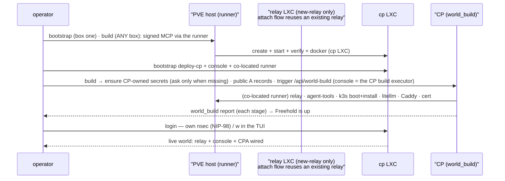
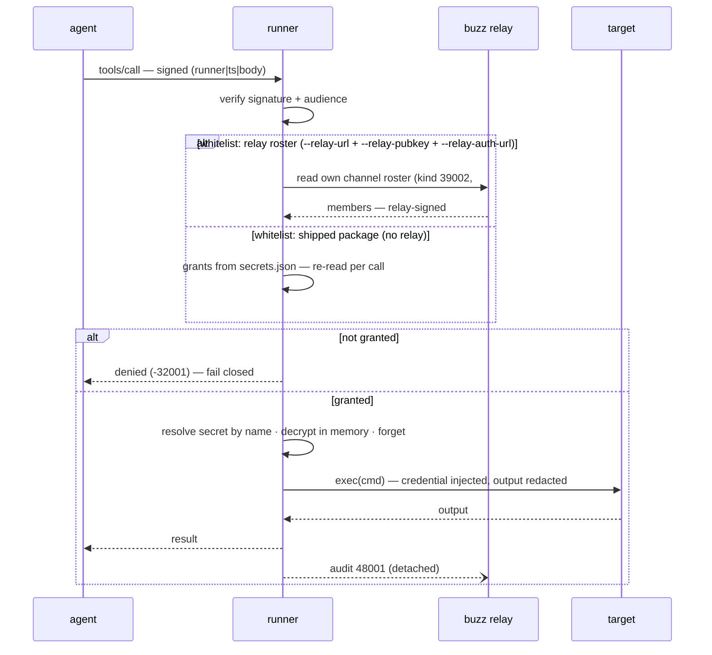

# freehold

> [!WARNING]
> **Pre-alpha, under heavy development.** freehold is **not ready to use**. It changes
> meaningfully day to day, so expect breaking changes, missing features, and possible data
> loss. Don't run it anywhere you care about yet.

freehold is an open-source appliance that is operated by AI agents. It lands a full
self-hosted stack on a Proxmox VE host or VPS — a self-hosted
[Buzz](https://github.com/block/buzz) relay as its hub, Kubernetes, reverse proxy and TLS,
and its own control plane. An Orchestrator and four department agents — Network, Data,
Compute, and AI — run it and create custom agents on request. Whatever you want can be
answered, built, hosted, and delivered.

## Contents

- [Agents](#agents)
- [Vision, Architecture & Roadmap](#vision-architecture--roadmap)
- [Getting started](#getting-started)
  - [The appliance: one binary, two surfaces](#the-appliance-one-binary-two-surfaces)
  - [The config](#the-config)
  - [Runner: identity + MCP server](#runner-identity--mcp-server)
  - [The console: provision a service, watch it go green](#the-console-provision-a-service-watch-it-go-green)
  - [Control plane CLI: provision a service](#control-plane-cli-provision-a-service)
  - [freehold: the CLI](#freehold-the-cli)
- [How it works](#how-it-works)
  - [Bootstrap flow (from zero to a live world)](#bootstrap-flow-from-zero-to-a-live-world)
  - [Runner setup + grant (from credential to first exec)](#runner-setup--grant-from-credential-to-first-exec)
  - [Runtime: one exec call (runner → exec → grant)](#runtime-one-exec-call-runner--exec--grant)
  - [Security model (no master key)](#security-model-no-master-key)
- [Repository layout (what things do in the code)](#repository-layout-what-things-do-in-the-code)
- [Contributing / review](#contributing--review)

## Agents

freehold is run by two tiers of agents, all living in Buzz:

**Orchestrator**

| Agent | Role | Services managed |
| --- | --- | --- |
| **@freehold** | The main touchpoint, on Buzz's `buzz-acp` harness (prompt in `agents/freehold/`). Holds the conversation, plans, delegates, and creates custom agents. | Agent lifecycle, agent grants |

**Departments**

Each department is scoped to one domain and the capabilities it owns.

| Agent | Role | Services managed |
| --- | --- | --- |
| **@network** | The network surface: access and exposure (external proxy, DNS, ingress). | Caddy, TLS, dnsmasq, Cloudflare, Tailscale |
| **@data** | The data plane: backups, storage, durability. | Proxmox storage (LVM/ZFS), PBS, TrueNAS, Backblaze (future) |
| **@compute** | The box itself and provisioning: CPU/RAM/disk, LXC and kube, remote hosts, monitoring. | Proxmox, k3s, Vultr, Hetzner, monitoring |
| **@ai** | Models, providers, and agents, plus local AI hardware. | LiteLLM, local AI (RTX 3090 / DGX Spark), benchmarking |

Talk is unrestricted — the operator and any agent may converse with any department directly.
What's bounded is *capability execution*: a capability a department owns is executed by that
department's identity, never by a custom agent that would self-serve a second, ungoverned
path to it. Whichever agent creates a service owns its install, config, and operation. The
Orchestrator and departments are installed as part of the core build — a pod each, in the
private `#freehold` plus its own private `#freehold-<department>` channel — and a rebuild reconciles them.

## Vision, Architecture & Roadmap

- [`docs/VISION.md`](docs/VISION.md) — the narrative and the "why".
- [`docs/ARCHITECTURE.md`](docs/ARCHITECTURE.md) — the system design and the locked decisions.
- [`docs/ROADMAP.md`](docs/ROADMAP.md) and [`docs/POC.md`](docs/POC.md) — the chunked
  plan and current scope, with the current chunk's plan alongside them
  (`docs/POC_CHUNK5.md`). [`docs/followups.md`](docs/followups.md) is the grab bag of
  deferred work.
- [GitHub Releases](https://github.com/darcy/freehold/releases) — the released versions,
  their notes, and assets.

## Getting started

Build once, then operate the world — the justfile only builds and installs, it never drives
the world itself.

Prereqs:

- **[mise](https://mise.jdx.dev/)** — installs and pins the toolchains (Go 1.25.0, Rust 1.98.0)
  and runs them through `mise exec`, so Rust and Go need no separate install
  (`curl https://mise.run | sh`, or `brew install mise`).
- **[just](https://github.com/casey/just)** — `mise use -g just`, or `brew install just`.

`just install` builds everything and puts `freehold` (plus the siblings it resolves at
runtime) on your PATH; `just build` alone leaves them in `target/`.

```sh
just build    # build the full binary set into target/debug + target/release
just install  # build, then place freehold + siblings on PATH
just test     # the full gate: Rust fmt/build/test + Go build/vet/test + the acceptance gate
```

Then operate the world yourself:

```sh
freehold install --yes --name <world> --host root@<box> \
                     --relay-domain <relay.host> --cp-domain <cp.host> --proxy-ip <ip/cidr>  # box one: create the CP only (door -> cp LXC + console + co-located runner), then STOP
freehold build       # ANY box (login-gated): trigger the console's /api/world-build — the CP brings up relay/agent-tools/k3s/storage/DNS/litellm/caddy/cert through its co-located runner
freehold teardown    # drop the WORLD (the inverse of build): relay/k3s + the CP-side
                     #  agent-tools process go, internal DNS clears — the CP, its runner,
                     #  the durable plane, and the certs all STAY; data is kept
freehold uninstall [--remove-data]  # drop the CP too (this box's doors + local state go;
                     #  --remove-data also drops the durable plane). Runs from the build box
                     #  or, for a thin box / dead CP, over direct root SSH; --remove-data
                     #  still needs the build box
freehold            # the TUI dashboard
```

`freehold install` (guided) or `install --yes` (headless) requires
`--name` + `--host`: the profile name scopes the config + state to
`profiles/<name>/` and prefixes the guest LXCs `<name>-<role>`; the host is
recorded in the profile so `uninstall --name` can resolve it. A fresh plane also
needs the relay/CP domains + proxy IP (the guided flow prompts for them). An
existing name whose CP is absent is re-adopted (the plane keeps the runner
identity); a **live** CP is refused — reconcile the world with `freehold build`,
drop it with `teardown`/`uninstall`, or join it with `freehold login`. `install
--yes` is the non-interactive surface.

### The appliance: one binary, two surfaces

```sh
freehold                      # no args → the interactive TUI (bubbletea); a subcommand → the CLI
freehold login                # root-free: CP address + operator nsec (NIP-98) → authorize,
freehold                      #   seed a local connection profile from the CP, then END — just run `freehold`
freehold logout               # clear THIS box's login ledger (CP/world untouched)
freehold status               # the CP's single inventory (read via public /api/world)
freehold build                # trigger the CP's world-build (co-located runner)
freehold teardown             # CP-preserving world teardown
freehold update               # update the world's CP (release assets / ref / dev),
                              #  run pending migrations, repin the version
freehold uninstall [--remove-data]  # remove the CP + world + this box's doors (data kept;
                              #  --remove-data drops the durable plane); a thin box / dead CP
                              #  uninstalls over direct root SSH
freehold door authorize       # authorize this box's door key on the host (DOOR_SPEC)
freehold door revoke          # remove this box's door key from the host door
freehold exec <target> "cmd"  # exec through a local runner, or (thin box, no
                              #  [runner]) through the CP's runner via world_exec
freehold provision --kind …   #   self-staged stages: provision, deploy-cp,
freehold deploy-cp …          #   storage, add-relay-member
freehold --help               # both surfaces
```

**Tenants (profiles)** — every box can hold several tenants, one per **profile**.
Each profile is its own config file (`~/.config/freehold/profiles/<name>/config.toml`)
plus its own scoped state dir (`~/.freehold/profiles/<name>/`). The filesystem is
the registry; `freehold profiles` lists them. `freehold login` **adds** a named
profile (default name = the CP host), and the TUI plus `build` / `install` /
`teardown` / `world` pick which profile (tenant) to operate when more than one is
registered (a picker), failing closed with "run `freehold login` first" when none
are. There is no implicit "default" profile.

**TUI modes** (auto-detected from the selected profile's config):

- **bootstrap** — no tenant profile selected: `freehold login` adds one, then
  `freehold build` runs the bring-up stages
  (provision → install the SSH door → grant → serve → verify the door with a
  real exec) and writes the profile's config.
- **configure** — config present, world not converged: an idempotent
  check-then-run pipeline (relay/cp LXCs, deploy relay + cp). Failed stages
  show their tail; `r` retries.
- **running** — the post-bring-up dashboard, six views cycled with
  `Tab` / `Shift-Tab`: **Services** (everything provisioned — name / where /
  status / data / url: relay + control plane today, k3s / litellm as their
  coordinates land in the config), **Agents** (the CP toolset's agent registry
  — name / pubkey / age of the agents the control plane has created),
  **Runners**
  (the console API parity — same data as the web UI), **Data** (the live durable plane — host capacity +
  each mount's size / used / guest bind-mount liveness, read-only through the
  signed runner channel; a management/login-only box renders the plane LAYOUT
  from the CP's world facts instead — live usage needs the deployer box),
  **DNS**, **Certs**. A one-line world strip keeps the
  liveness glance.
- **Remote-CP access**: `freehold login` (**root-free**) **adds a tenant profile** —
  authorize this operator against the CP by **CP address + operator nsec**
  (NIP-98), then **ends** — afterwards just run `freehold` and pick the profile.
  It pulls the CP's `/api/world` summary and seeds that profile's connection/
  desire config (relay + CP coords, the CP's own identity, the operator pubkey
  derived from the nsec), so a fresh box recovers with nothing that lived only
  on a lost one. The operator nsec persists 0600 under the profile's
  `control-plane/operator` dir (excluded from
  any off-box backup/sync — it is a box-local, user-held key). The operator key
  **is** the credential: the console only admits NIP-98 operators whose pubkey
  was minted into its admin whitelist at deploy, so logging in as yourself from
  any box unlocks the world. The recorded `cp_pubkey` is the CP's *own* identity
  adopted from its `/api/world` self-report — informational, never typed (a
  legitimate login to the actual CP needs no separately-known pubkey, and the
  trust boundary for a wrong/hijacked `cp_url` is TLS/DNS on that URL, not this
  recorded anchor). `login` also materializes the box's
  **own** provisioning identity (the profile's `control-plane/agent-ops`,
  first-run-wins — the identity `freehold build`/`teardown` sign with), so the
  box is a durable, self-owned actor; it does **not** fabricate a `[runner]`
  block (that is the deployed runner's own identity, authored by `build`). In
  the TUI, `l` re-logs into the CP console with that persisted nsec, and
  `freehold logout` clears the chosen profile's local ledger only (CP/world
  untouched, box
  identity kept). `w` then opens the web console in your browser already
  authenticated (single-use portal token — no `console-login`). Keys are scoped
  to the active view.

The same session flows bootstrap → configure → running as the world converges.

The TUI's bring-up flows and the `freehold install` command drive the shared
provisioning engine — one pipeline, no
duplicated logic. `freehold install` on an interactive terminal collects every
answer (world name, relay/CP domains + the proxy IP) up front in a bubbletea wizard, then
hands the engine the collected flags; non-TTY input keeps the sequential
prompts. Re-runs are safe: an
existing runner package is reused, the door is re-verified, and a matching LXC
is reused (a foreign container on the vmid is refused).

#### The config

Each tenant profile's config lives at `~/.config/freehold/profiles/<name>/config.toml`
with its state under `~/.freehold/profiles/<name>/` (overridden by `FREEHOLD_HOME`).
The config is that tenant's CONNECTION/DESIRE profile:

```toml
domain = "freehold-test.example.com"
relay_url = "https://freehold-test.example.com"
cp_url = "https://cp-freehold-test.example.com"
operator_pubkey = "1dc07610…"           # console admin + relay owner
operator_identity = "/home/you/.freehold/control-plane/operator"   # YOUR key, 0600 —
                                        # the TUI auto-logs in with it; optional when
                                        # you pasted an npub (use the portal to authenticate)
managed = ["relay", "cp"]      # what WE operate — an invited relay wouldn't be here

[runner]                       # the provisioning door (the exec path into the host)
addr = "127.0.0.1:8787"
pubkey = "f7510b07…"           # the runner's own identity (filled at config-write)
target = "proxmox-box"

[lxc.relay]                    # connect/status coords only; sizing is bootstrap-time
vmid = 100
ip = "192.168.30.8/24"

[lxc.cp]
vmid = 101
ip = "192.168.30.9/24"
```

### Runner: identity + MCP server

```sh
cargo run -p freehold-runner -- keys init     # writes ./.freehold/identity.json (0600)
cargo run -p freehold-runner -- serve         # MCP over HTTP, default 127.0.0.1:8787
                                              # (FREEHOLD_RUNNER_ADDR, loopback only)
```

The runner refuses non-loopback binds unless `--allow-remote` is passed (signed calls are the
boundary) and refuses non-loopback Origins (DNS-rebinding guard). Every
`exec`/`config`/`status`/`snapshot` call must be signed by a GRANTED agent pubkey or it
fails closed. The whitelist has two sources: the shipped package (re-read from disk per
call, `control-plane grant <runner> <pubkey>` with no relay configured) or the
runner's OWN channel roster on the relay (`--relay-url` + `--relay-pubkey`, plus
`--relay-auth-url` when the dial is a LAN origin — the runner dials `http://<domain>:3000`
but NIP-98-signs the canonical public URL): grants ARE channel membership, read live per
call from the relay-signed kind-39002 snapshot, so a revoke lands without a restart.

### The console: provision a service, watch it go green

```sh
freehold-console serve --state-dir /srv/data/cp/control-plane
# open http://127.0.0.1:8080 — admin/ops only (chat is Buzz's job)
```

Paste a credential into the provision form (or `POST /api/provision`). The console ships the
runner package, registers the runner's MCP address, and the overview shows the runner's OWN
self-check per target — 🟢/🟡/🔴 — probed through the same signed MCP channel an agent
uses. Manage: rotate, revoke, grant/revoke-grant, set MCP addr.

### Control plane CLI: provision a service

```sh
freehold-console provision vultr \
  --kind vultr --address api.vultr.com --secret-env VULTR_KEY --state-dir /srv/data/cp/control-plane

# grant the console/ops identity (or an agent) so it may call the runner
# (everything else fails closed); omit --pubkey for the state dir's own identity:
freehold-console grant vultr --state-dir /srv/data/cp/control-plane
```

What just happened (verify it yourself):

- `/srv/data/cp/control-plane/runner/vultr/identity.json` — the runner's injected private
  keys (0600); `--runner-dir` overrides the location
- `/srv/data/cp/control-plane/runner/vultr/secrets.json` — the API key as sealed ciphertext only
- `/srv/data/cp/control-plane/state.json` — pubkeys + ciphertext only; grep for the API key
  and for `nostr_secret`/`enc_secret`: **zero matches** (the no-master-key proof)

```sh
# rotate the credential (web/API-only: POST /api/rotate — re-seals to the same runner key)

# revoke a runner: blocks provision/rotate, deletes the shipped secrets.json
freehold-console revoke vultr --state-dir /srv/data/cp/control-plane

# service-at-a-glance: GET /api/overview (no plaintext in output, ever)
```

Provision refuses to clobber: a name that exists, or a `--runner-dir` that already holds a
package, errors instead of destroying a runner's key.

### freehold: the CLI

The CLI binary is `freehold`, built from the `freehold-cli/` Go module (one binary, two
surfaces):

```sh
go build -C freehold-cli -o ../target/debug/freehold ./cmd/freehold
freehold --help
```

```sh
# drive a RUNNING runner with signed calls:
freehold exec blog 'curl -sS "$VULTR_URL/v2/instances" -H "Authorization: Bearer $VULTR"' \
  --addr 127.0.0.1:8787 --agent-dir ./.freehold/control-plane/agent-my-agent \
  --runner-pubkey <runner-nostr>

# World bring-up, one step at a time (every command routes through the
# provisioning runner — the workstation never holds a PVE credential itself).
#   bootstrap: create + start + verify a fresh LXC via pct on the PVE host,
#   then install docker+compose in the guest. No A4 DNS gate — the relay/CP
#   hosts resolve internally behind the proxy, so install never blocks on DNS.
#   --role relay|cp derives the LXC name from --domain.
freehold provision --kind proxmox-lxc --role relay \
  --vmid 100 --lxc-ip <lan-ip>/24 --lxc-gw <lan-gw> --domain <relay-domain> \
  --operator-pubkey <your-64-hex> --addr 127.0.0.1:8787 \
  --agent-dir ./.freehold/control-plane/agent-my-agent --runner-pubkey <runner-nostr>

freehold provision --kind proxmox-lxc --role cp \
  --vmid 102 --lxc-ip <lan-ip>/24 --lxc-gw <lan-gw> --domain <relay-domain> \
  --operator-pubkey <your-64-hex> --addr 127.0.0.1:8787 \
  --agent-dir ./.freehold/control-plane/agent-my-agent --runner-pubkey <runner-nostr>

#   deploy-cp: ship the control-plane binary (base64 chunks) + a co-located
#   runner package into the cp LXC, start serve (console identity is MINTED
#   ON THE BOX — a keypair is never shipped), adopt + self-grant the runner.
#   --operator-pubkey seeds the console's NIP-98 admin whitelist and
#   relaxes the loopback-only bind guard (operator authn => LAN bind).
#   --world-config (cpbuild.Coords JSON) bounds the console as the CP build
#   executor: it surfaces the coords so a thin box can trigger /api/world-build.
freehold deploy-cp --target proxmox-box --lxc 102 \
  --binary target/release/freehold-console --runner-binary target/release/runner \
  --runner-package ./.freehold/runner/proxmox-box-ish --bind 0.0.0.0:8080 \
  --relay-url https://<relay-domain> --operator-pubkey <your-64-hex> \
  --addr 127.0.0.1:8787 --agent-dir ./.freehold/control-plane/agent-my-agent \
  --runner-pubkey <runner-nostr> --world-config '{"runner_addr":"127.0.0.1:8787",...}'

#   deploy-relay: docker gate -> curl+tar bundle (pinned buzz ref) -> compose
#   .env (BUZZ_DOMAIN/RELAY_URL = the domain, RELAY_OWNER_PUBKEY = the CP
#   console, operator invite, local-CA TLS) -> compose up -> /_liveness.
#   Run AFTER deploy-cp: --owner-pubkey is the freshly minted console pubkey.
freehold deploy-relay --target proxmox-box --lxc 100 \
  --owner-pubkey <fresh-console-pubkey> --operator-pubkey <your-64-hex> \
  --domain <relay-domain> --relay-url https://<relay-domain> \
  --addr 127.0.0.1:8787 --agent-dir ./.freehold/control-plane/agent-my-agent \
  --runner-pubkey <runner-nostr>

#   add-relay-member: community membership is the SECOND layer (channel
#   membership via 9000/9001 is not enough for relay queries). Add the fresh
#   console pubkey / operator keys / runners / agents via buzz-admin in the
#   relay LXC — the CP never holds the relay signing key.
freehold add-relay-member --target proxmox-box --lxc 100 \
  --pubkey <pubkey-or-operator-key> --addr 127.0.0.1:8787 \
  --agent-dir ./.freehold/control-plane/agent-my-agent --runner-pubkey <runner-nostr>

#   grants: grants ARE channel membership. With --relay-url, grant publishes a
#   put-user to the runner's channel; the runner re-reads its relay-signed
#   roster per call. (revoke-grant is the /api/revoke-grant web action.)
freehold-console grant my-runner --pubkey <agent-pk> --relay-url https://<relay-domain> --state-dir /srv/data/cp/control-plane

#   a relay-configured runner (whitelist = its own channel roster, verified
#   against the relay's pubkey):
cargo run -p freehold-runner -- serve --state-dir ./.freehold/runner/my-runner \
  --relay-url https://<relay-domain> --relay-pubkey <relay-signing-pubkey>

#   rebuild (disposable CP): the fold primitives (relay.QueryRunnerMetas +
#   StateStore.RebuildFrom) reconstruct a respawned CP from the relay's
#   runner-profile channel messages (kind 9, t=fh-profile) — deterministic +
#   idempotent, author-gated (a fresh console reads nothing until re-admitted).
#   Coverage lives in the Go acceptance gate (`go test ./acceptance/…`).
```

## How it works

Three roles, one primitive. A **control plane** (admin/ops only — chat is Buzz's job) drives
**runners**, the privileged exec endpoints that own connections and credentials on the target
side. **Agents** are the brain, **runners** are the dumb hands — an agent signs a call and
the runner executes one generic primitive, `exec(cmd, target, stream?)`, with no semantic
tools. Agents live in Buzz as pods; one control plane is exactly one relay scope and attaches
to the relay, so co-location is convenience, never assumed. It's host-flexible: Proxmox leads,
VPS/cloud are first-class, and the k8s layer above the host driver is identical on every
substrate. The sections below walk the lifecycle from a bare box to a running exec call.

### Bootstrap flow (from zero to a live world)

`freehold build` is **login-gated, drive-through-CP**: after
`freehold install` (box one) creates the CP, ANY box runs `freehold build` to trigger
the console's `/api/world-build` — the CP brings up the WHOLE world
(relay/agent-tools/k3s → DNS → litellm → Caddy → cert → CPA) through its own
co-located runner. A fresh box only needs `freehold login` (root-free) → then
`freehold` to trigger. Every command routes through a **provisioning runner**
(one `exec(cmd, target)` — the same primitive agents use), so the workstation
never holds a PVE credential of its own: the runner's injected SSH key is the
only door. The relay + CP hosts are identity (never an IP): they resolve
internally behind freehold's Caddy proxy, so install does not block on DNS.
Consoles **mint their identity on the box** (a keypair is never shipped); the
relay runs under its host with owner = the CP console.

**The same story as a sequence:** four lifelines — operator, PVE host (where the runner
lives), relay LXC, cp LXC. Solid arrows = commands (the runner executes them over SSH);
dotted arrowheads = replies that end their command; dotted-open (async) = a report sent
while a bootstrap call is still in flight.



The reload path folds a respawned/rebuild CP from the relay's runner-profile channel
messages (kind 9, `t=fh-profile`) — deterministic, idempotent, and author-gated. The fold
primitives are `relay.QueryRunnerMetas` + `StateStore.RebuildFrom`, exercised by the Go
acceptance gate.

### Runner setup + grant (from credential to first exec)

**What happens when a runner is first set up and an agent is granted:** the control plane
generates the runner's identity, seals the credential TO the runner's key, ships a package
with ciphertext + the runner's private key (recording only pubkeys + ciphertext — no
plaintext, no master key), then creates the runner's private NIP-29 channel in the relay
and members the runner. A grant **adds the agent to that channel**; the runner's whitelist
is its own relay-signed roster, read per call.

```mermaid
sequenceDiagram
    participant OP as operator
    participant CP as control plane
    participant RUN as "runner box (my-runner)"
    participant BR as "box runner (proxmox-box)"
    participant REL as buzz relay
    participant AG as agent

    OP->>CP: provision my-runner --kind ssh<br/>--address root@host (credential pasted)
    CP->>CP: generate runner identity<br/>(Nostr + encryption keypairs)
    CP->>CP: seal credential to the runner's<br/>encryption pubkey — ciphertext only
    CP->>RUN: write the package onto the runner's box<br/>(identity.json + secrets.json — ciphertext, targets)
    CP->>CP: record pubkeys + ciphertext in state.json<br/>(no plaintext, no private keys)
    CP->>REL: create the runner's private channel (9007)<br/>h = sha256(runner pk)[0:16] (uuid form) — owner = the console
    CP->>REL: member the runner itself (9000 put-user)<br/>— the channel layer
    CP->>BR: relay-member add — the runner's pubkey<br/>(community layer)
    BR->>REL: buzz-admin add-member (kind 13534) —<br/>without it, roster reads 403
    CP->>REL: publish the runner profile<br/>(kind-9 fh-profile message)
    RUN->>RUN: runner serve --relay-url<br/>(+ --relay-auth-url / --allow-remote as needed;<br/>whitelist = its own channel roster)
    CP->>RUN: readiness probe (signed MCP)
    RUN-->>CP: green
    OP->>CP: grant my-runner agent-pubkey
    alt relay configured (the channel flow)
        CP->>REL: add the agent to the channel (9000 put-user)
        REL->>REL: re-mint the roster (39002, relay-signed)
        RUN->>REL: read own roster — agent is a member (per call)
    else no relay (shipped-package grants)
        CP->>RUN: re-ship the package with the new grant
        RUN->>RUN: re-reads grants from the package (per call)
    end
    AG->>RUN: tools/call (signed) — first exec
    RUN-->>AG: result (credential injected, output redacted)
```

With a relay, the grant is a channel membership write (`put-user`); without one, it is a
package re-ship — both land without a runner restart, and revoke is the inverse
(`remove-user` / re-ship minus the grant). Membership is TWO layers: the channel (9000)
grants the whitelist, but the runner also needs COMMUNITY membership (relay-member →
buzz-admin, kind 13534) before ANY of its relay reads work — non-members get
`403 relay_membership_required` and the runner fails closed. The community add is driven
through the box runner (proxmox-box, the provisioning/relay-admin runner who holds the
credential into the relay LXC), not by my-runner itself.

### Runtime: one exec call (runner → exec → grant)

The data path behind any agent action: an agent signs a call, the runner verifies the
signature AND the grant before touching anything, secrets resolve BY NAME from the sealed
package (decrypt in memory, forget), and the op is audited. Grants are read FRESH per call —
from the shipped package, or live from the runner's own relay-signed roster when a relay is
configured — so `grant`/`revoke` land without a runner restart.

**What happens on one exec call:** an agent's signed call reaches the runner, which
verifies the signature and the grant before decrypting the credential by name and running
the command on the target — the whitelist is read fresh per call (package, or the relay
roster when configured), so revokes land without a restart. Solid arrows = calls; dotted
arrowheads = replies; dotted-open = detached (the audit publish never delays the exec).



### Security model (no master key)

- The CP never holds a private key that decrypts anything, and never holds plaintext
  (credentials are sealed, forgotten). The only key under the CP state dir is the console
  AGENT key — it signs readiness probes and is provably not the encryption recipient of
  any runner (G3.3 checks this).
- The runner holds ciphertext + its own injected private key; only that key opens its
  blobs, and a blob only opens under the secret name it was sealed with.
- Rotation re-seals a NEW credential (the erase lever for your copies); revocation blocks
  provision/rotate and deletes the shipped credential. Honest limits are written down in
  `AGENTS.md` (no remote revocation of a capability someone else kept; re-keying and
  epoch/staleness are named follow-ups; a RUNNING runner keeps its in-memory credential
  until restart — rotate/re-grant reach the next boot).

## Repository layout (what things do in the code)

```
Cargo.toml            Rust workspace: control-plane/core, control-plane/runner,
                      control-plane/testkit, control-plane/core/harness/oracle
agents/               freehold/agents — the agent definitions, embedded as Markdown:
                      freehold/ (the Orchestrator prompt + skills), custom/ (the
                      template for agents it creates), common/orientation.md, and the
                      four departments (network/, data/, compute/, ai/). Its own Go
                      module; the control plane imports the bytes.
contract/             freehold/contract — the shared wire/trust leaf both the control
                      plane and the platform import: crypto/ (Go repro of the Rust
                      core, byte-exact cross-verified by the harness), wire/, client/
                      (the signed MCP client), config/, console/, relay/, identity/,
                      worldfacts/, delegate/, version/. Its own Go module, so the edge
                      is platform → contract ← control-plane (no module cycle).
control-plane/        freehold/control-plane — the stable mechanism (Go logic, Rust
                      only for runner + core):
  api/                the scoped API (agent tools + operator world actions) and
                      cmd/freehold-agent-tools (the agent-management MCP server the
                      agent pods bridge at boot)
  api/console/        the loopback admin/ops web surface (NIP-98 login, session
                      cookies, single-use portal, DNS-rebinding guard)
  secret-management/  provision/rotate/revoke/grant (the provisioner)
  state/              the CP state store
  acceptance/         the acceptance gate (Go): drives the real `runner` binary as a
                      subprocess
  core/               (Rust) freehold-core — the byte-exact contract oracle, shared
                      by every crate, no product logic
    src/identity.rs   Nostr (secp256k1) + X25519 keypairs; env-inject or 0600 file
    src/auth.rs       the signed-call protocol: BIP-340 signatures over
                      `runner_pubkey|ts|raw_body`
    src/crypto.rs     sealed box TO a runner's X25519 pubkey: ephemeral X25519 +
                      HKDF-SHA256 + ChaCha20-Poly1305; recipient AND secret-name
                      bound; low-order-point forgery rejected; versioned wire format
    src/secrets.rs    SecretPackage: the runner's on-disk secrets.json (name →
                      ciphertext, target metadata, agent grants)
    src/audit.rs      BIP-340-signed audit log (0600), caller pubkey recorded
    src/futil.rs      atomic file discipline: 0600-at-birth temp + fsync + rename;
                      0700 state dirs
  runner/             (Rust) freehold-runner — the privileged connector bridge
    src/mcp.rs        MCP-over-HTTP tool server; every tools/call is signed by a
                      GRANTED agent pubkey or fails closed
    src/exec.rs       the ONE generic primitive: exec(cmd, target, timeout) — secret
                      values resolved BY NAME from ciphertext, redacted, audited
    src/ssh.rs        russh connector: in-memory keys, pooled connections, TOFU
    src/main.rs       CLI: `runner keys init`, `runner serve`
  testkit/            (Rust) freehold-testkit — hermetic mock Vultr/B2 API servers +
                      an in-process russh sshd
freehold-cli/         freehold/freehold-cli — the local operator surface (never
                      imported by control-plane/): one dir per verb (install/,
                      uninstall/, build/, teardown/, status/, update/, exec/,
                      profiles/, door/, add-relay-member/, dns-cred/), plus login/,
                      tui/, and internal/ (artifact, certcred, common, cpdeploy,
                      stages)
providers/            freehold/providers — the substrate providers; proxmox/ holds
                      guest create/exec/list, storage, the pct stage/DNS builders,
                      and the world-destroy engine. Imports platform/ + contract/;
                      never the reverse.
platform/             freehold/platform — the provider-independent world the mechanism
                      installs/evolves: services/<capability>/<impl>/ (relay/buzz,
                      webproxy/caddy, externaldns/cloudflare,
                      certificates/letsencrypt), provisioning/ (bootstrap, box,
                      deploy, planebase, stages, the provider seam), migrations/
                      (<epoch>.sh scripts + markers). Adding a service touches only
                      this module — never control-plane/.
migrations/           the box-applied migration scripts
AGENTS.md             agent guidance: locked model, conventions, known gaps
docs/                 VISION.md, ARCHITECTURE.md, ROADMAP.md, POC.md, POC_CHUNK5.md,
                      BUZZ_SURFACE.md, DOOR_SPEC.md, followups.md
```

## Contributing / review

Every PR runs two gates:

- **CI** (`ci.yml`): `cargo fmt --check`, `build`, `test`, `clippy -D warnings` on the
  workspace (toolchain pinned to the declared `rust-version`). Green/red, no exceptions.
- **AI review** (`ai-pr-review.yml`, "Bot Review"): reviews for real problems only. Findings
  are tiered in the top-level comment — BLOCKING (must fix) / IMPORTANT (should fix) / DEFER
  (named follow-up, never re-raised) / NIT (stays silent). Inline comments appear only for
  BLOCKING/IMPORTANT, on the exact lines. Every review ends with a one-line verdict:
  `MERGE-READY: <reason>` or `NEEDS WORK: <n> BLOCKING, <m> IMPORTANT`, and submits that as a
  PR review state — `APPROVE` when clean, `REQUEST_CHANGES` with findings — so branch
  protection gates a merge rather than a red check. The operator overrides a `REQUEST_CHANGES`
  by dismissing the review.
- **README / ARCHITECTURE drift**: when a PR changes something those docs document (or drifts
  from a locked decision in `docs/ARCHITECTURE.md`), the reviewer adds one `README:` /
  `ARCHITECTURE:` line to the top-level comment — a signal to update it or ignore, never a
  blocker, never nitpicked.

Read `AGENTS.md` before changing code: the locked model (relay-as-scope, generic exec, no
master key, host flexibility) is not open for reinterpretation. Never commit secrets,
private keys, or plaintext credentials.
