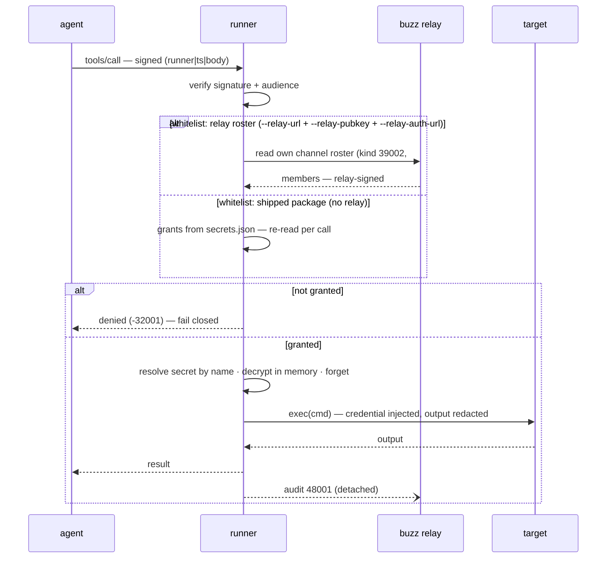
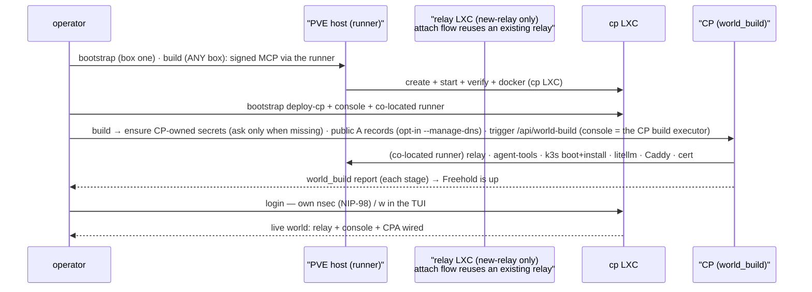

# The AI-operated Appliance — Architecture

Product: an open-source "box + install script" (Omarchy-style) that lands a
Proxmox VE / VPS + Kubernetes stack with Buzz Relay as the control plane and
a skill framework that installs and configures self-hosted OSS. This doc is the
current architecture of the core platform: the trust model, the control plane,
the operator surface, and the agent org. Each department's architecture, known
gaps, and plans are in its own doc (`docs/AI.md`, `docs/NETWORK.md`,
`docs/DATA.md`, `docs/COMPUTE.md`); the core's gaps and plans are in
`docs/FREEHOLD.md`; the ordered view is `docs/ROADMAP.md`. Narrative: "reclaim
the future we were promised" — the full rationale lives in `VISION.md`.

## System layout

```
Operator ──chats via──► Buzz relay (Buzz-operated; host: self-hosted LXC/VM or VPS)
                           │  CPA + expert agents live in Buzz
                           │  chat / memory (30174) / audit (48001) / jobs (43001–6)
                           │
              tools ▼      │   ▲ agents connect with their OWN keypair
        ┌──────────────────┘   │   (gates: signature, audience, expiry, replay)
        ▼                      ▼
   freehold / the CP (Go) drives freehold-runner (Rust, independent)
        │  single `exec` MCP tool (runShell) — dumb privileged hands
        │  signed, addressable, audited
        │  NO LLM, NO router, NO key vault in either
        ▼
   Target: pct LXC (relay/CP/gateway) | pct LXC on a VPS host | k8s (MVP only)
        │
        └──backups──► freehold snapshot (the plane) · freehold export (the data bundle)
                      · freehold backup (restic → sftp/B2/any URI) | PBS | TrueNAS
```

*   **One control plane = exactly ONE relay scope** (relay-as-scope). The CP
    lives on its own target (a dedicated LXC/VM, a VPS, or a VM with k8s in
    v1) and *attaches to* the relay — co-location is convenience, never
    assumed. A user's existing relay is onboarded as a service (via a relay
    runner), not a nested scope. No "control plane of control planes."

*   **Agent pods are bare v1 Pods in the k3s LXC's `agents` namespace** — the CPA
    and every agent it creates, plus the four departments — running Buzz's
    `buzz-acp` remote-agent harness. Identity, workspace, prompt, memory, and the
    tool bridge are described in `docs/AI.md` (the agent runtime). Runners are
    separate — see the Runners section below.

*   **Agents never hold secrets — the runner flow makes that enforceable, not a policy.**
    An agent reasons; a runner (no LLM, no vault) owns the connection, executes commands
    verbatim, injects credentials per attempt, and is audited. The CP provisions secrets
    (encrypt to a runner's key, ship ciphertext, rotate) — it is not a vault, and agents
    reference credentials by name only. Grants are coarse (agent ↔ runner, one runner per
    capability), ride native Nostr kinds, and the full model — including grants on the fly —
    is the AI architecture: `docs/AI.md`.

*   **CPA + experts live in Buzz:** the CPA is a real reasoning agent (the
    system's main user touchpoint); experts are deterministic or
    reasoning-class. The CPA gets its purpose from `agents/freehold/prompt.md`.

*   **Host-flexible:** Proxmox is the lead/default; VPS/cloud are first-class
    (the business path). The k8s layer and everything above the
    host driver run identically regardless of substrate.

*   **Backups are the load-bearing wall — and no PBS VM is required for them:**
    `freehold snapshot`, `freehold export`, and `freehold backup` (restic to an
    arbitrary URI) cover the chain with the tools the system already runs; where a
    PBS server exists it stays a target, not a dependency (`docs/DATA.md`).

*   **Filesystem layout convention (the `/srv/data` convention).** State that must
    survive a rebuild lives on dedicated mount points, never plain rootfs dirs:
    `/srv/data/relay` (relay deploy data), `/srv/data/cp` (CP state: sealed secrets,
    `providers.json`, console + agent-tools identity), `/srv/data/k8s-volumes` (durable
    PVCs and agent workspaces), and the relay's `/var/lib/docker` (its databases) —
    each born at `pct create` with an explicit `backup=1`. Nothing in the POC needs a
    cluster to be durable. The mount layout, the backup flag rule, the relay
    carve-out, and the pinned PVC roots are specified in `docs/DATA.md`; how the
    volumes come to exist is in `docs/COMPUTE.md`.

*   **The CP host itself must be reconstructible, not durable:** booting a
    fresh target on *different* hardware (and even a different distro) from
    the recorded config + the durable `/srv/data` mounts is the whole point.

## The pieces

### `contract/` (`freehold/contract` — the shared wire/trust leaf)

* **Purpose:** the language-agnostic trust, crypto, and wire contract that
  BOTH the control plane and the local CLI + platform import — the leaf
  everything builds on. It is its own Go module so the edge is `platform →
  contract ← control-plane` and `platform → contract ← freehold-cli`, never
  `platform → control-plane` (no module cycle). It carries `crypto/` (the Go
  repro of the Rust `core`), `wire/` (envelopes), `client/` (the signed MCP
  client), `config/`, `console/` (the console client), `relay/` (the relay HTTP
  client), `delegate/` (the kind-9 delegation envelopes), `identity/` (the
  identity.json format loader), `nipoa/` (the NIP-OA owner attestation — the
  `["auth", owner, conditions, sig]` tag that rides every agent pod as
  `BUZZ_AUTH_TAG` and gives the agent's `buzz mem` its owner; conditions
  bounded to `kind=30174`, self-attestation refused), and `worldfacts/` (the
  world-inventory wire shape). The CP's `state/` store lives in
  `control-plane/` (server-only).

* **Contents:** NIP-44 v2 encryption (chacha20poly1305, bech32, hkdf-sha256,
  sha256, hex) and the signer (`CryptoProvider` over `CryptoDyn` —
  `secp256k1` + `ring` only; `bip39`, `bs58`, and `keyring` are unused).

* **Rust→Go port status:** the Go `contract/crypto` reproduces the Rust
  `core` surface **byte-exactly** — verified by
  `control-plane/core/harness/harness_test.go`, which drives the Rust
  `freehold-harness-oracle` binary and locks every primitive against it
  (BIP-340 via btcec/v2, X25519+HKDF+ChaCha20-Poly1305, bech32 nsec,
  ed25519, `SecretPackage` as sorted-map JSON matching serde's `BTreeMap`
  output, NIP-98 canonical events, kind-48001 audit, NIP-44 v2 engrams).

* **`RunnerCall`:** `{call_id, ts, nonce, issuer, audience, tool, args, sig}`
  (full schema + per-field notes in `RUNTIME_CONTRACT.md`).

* **`SecretPackage`:** `{secrets:[{name, ciphertext(nonce‖ct), nonce,
  aad:"<name>", alg:"sealed-ex-nopb-hkdf-sha256-cha20p1305", tags,
  issuer, audience:[...], active, created}]}`.

* **`identity.json` / `providers.json`:** identity holds `nostr_secret`
  (nsec) + `enc_secret` (nenc), both encrypted under the *plaintext*
  `enc_secret` key; `providers.json` (control-plane only) holds opaque
  `params` per connector.

### `control-plane/` (`freehold/control-plane` — the stable mechanism)

*   **The mechanism is one Go module** (go 1.25): `api/` (the unified scoped
    API — agent toolset + world actions + `cpbuild`), `secret-management/`
    (provision/rotate/revoke/grant), `state/` (the CP store), and the Rust
    crates `core/` (the byte-exact contract oracle + the `harness/` Go
    byte-gate), `runner/`, and `testkit/` (the runner's hermetic fixtures). The
    acceptance gate is Go under `acceptance/`, driving the real
    `runner` binary as a subprocess. The local operator interface (`freehold`
    CLI + TUI, `login/`, `flows/`, install) lives in the sibling
    `freehold-cli/` module; the server never imports it.

*   **Two apps, zero cross-imports (local/server split).** The server
    (`control-plane/`) and the local operator surface (`freehold-cli/`) are
    separate Go modules. `control-plane/` never imports `freehold-cli/`;
    `freehold-cli/` never imports `control-plane/` — the local side drives the
    server through the CP API (console HTTP / agent-tools MCP) or by invoking
    its binaries, never by linking its packages. An import-graph guard test in
    each module enforces both directions. Anything both sides genuinely need
    (crypto/wire/client/config/console/litellm, the relay + delegation protocol
    clients, the identity loader, the world-facts shape) lives in the
    `contract/` leaf. The build engine (world bring-up/teardown) is server-side
    (`api/cpbuild`); local `build`/`teardown` are thin CP triggers, and CP
    creation is `freehold install` (in `freehold-cli/`).

*   **The privileged `exec` funnel lives in the RUST runner, not the CP.**
    The CLI is the operator's interface: it drives a running runner over its
    MCP endpoint (`contract/client/mcp.go`, the shared signed-header scheme)
    for world-bring-up. The runner (`control-plane/runner/`, Rust) is the
    dumb privileged hands — `exec(cmd, target, stream?)`, signed by a granted
    pubkey, fail-closed, auditors per command.

*   **`freehold-agent-tools` is a distinct SEMANTIC surface on the CP**, not
    the runner's `exec`. Its Go methods (`control-plane/api/agent/tools.go`,
    `create_agent`/`update_agent`/`provision_runner`/`revoke_runner`/`grant_agent`/`manage_agent`) are served
    in-process by
     `control-plane/api/cmd/freehold-agent-tools` (`serve`, HTTP `/mcp`),
     authorized per call against the server's own relay roster (NIP-29 channel
     + 39002, fail-closed) **and scoped by caller class**: a pubkey in the CP's
     agent registry is an AGENT (create/manage + the `provision_runner` and
     `revoke_runner` carve-outs — the world_* actions AND `grant_agent` are denied server-side,
     so the CPA's boundary cannot be bypassed by calling the server directly);
     a roster
     member not in the registry is an OPERATOR (full toolset incl. world_* and
     grant). The Caddy CP vhost exposes `/mcp` publicly (→ `:8089`) and
     `/api/world` serves `agent_tools_url` as the public `https://<cp>/mcp` plus
     `console_enc_pubkey` (the console identity's X25519 encryption public key,
     the seal recipient for CP-owned secrets — so a thin box hands them off with
     no runner to exec into the CP), so a REMOTE thin box drives the world
     (build/exec/migrate/door) over the edge — the drive-through-CP transport. Its `mcp` stdio mode is the bridge agent
     pods fetch at boot (same create/manage-only filter, now defense-in-depth).
     The build dogfoods
     `create_agent` to bring the CPA up. It
    also carries the CP world-action surface (`world_status` / `world_teardown`
    / `world_migrate` / `world_build` / `world_register_facts` — the operator
    world verbs moved to console routes, so only `world_migrate` remains
    operator-reachable there, via the console's proxy; the rest is now
    unreachable surface, kept for the migration-window contract) so an
    operator box can
    "login + trigger" the world: `world_build` runs the CP's owned
    bring-up/reconcile stages (`platform/provisioning/stages`) through its
    co-located runner — the direction `freehold build` (box) slims toward
    (CP-bring-up + trigger; the CP owns relay/storage/k3s/DNS/litellm/Caddy/
    cert). The stages live in the shared **`cpbuild`** package, and the console
    is the **CP build executor too**: `freehold-console serve` builds a
    `cpbuild.Spec` (from the `--world-config` coords deploy-cp hands it, signed
    as the console's own identity and self-granted on the co-located runner)
    and exposes an operator-scoped **`/api/world-build`** — a thin box can
    bring the world up through the CP WITHOUT the relay roster agent-tools
    needs, so relay+agent-tools can live in `build` (the install/build split).
    Its **`/api/world-teardown`** mirror runs the
    shared teardown engine through the co-located runner — relay/k3s removed and
    the CP-side agent-tools process stopped, while the CP + its runner survive
    (`teardown` is the inverse of `build`; `uninstall` removes the CP) — so a
    login-only box can also tear the world down. **`/api/world-exec`** and
    **`/api/world-door`** complete the set: the session-authed drive-through-CP
    exec and DOOR_SPEC authorize/revoke a thin box (and `freehold login`'s door
    present) use — the operator's trust root is the console session, never the
    relay roster. **`/api/world-migrate`** proxies into the agent-tools serve
    (signed as the console — the serve's local admin peer) because the
    migration scripts must run in THAT process to take the registry write lock.
    `world_exec` is the **drive-through-CP exec**
    surface: a THIN login
    box (no local `[runner]`) runs commands on the CP's co-located runner via
    this tool — so a login box is functionally equivalent to the box that
    bootstrapped, an authorized operator client rather than a runner host.
    `world_status` assembles the **single inventory read** (agents + the
    console's runners/DNS read underneath — the console's state.json on the
    box — plus the deployer-side world facts (`world_register_facts`: the
    durable-plane layout, canonical domains, and edge cert metadata the box
    registers at the end of `freehold build`)). It is served **twice from one
    assembly** (`agenttools.WorldStatus`): the console folds it into its public
    `/api/world` (consumed by the TUI and `freehold status`), and the
    `/mcp world_status` tool shares that same assembly for direct MCP callers —
    so the two surfaces can never diverge. The toolset's callers are the
    relay-roster members (the AGENT surface — the CPA, membered at create)
    plus two signature-verified LOCAL PEERS that are never roster members:
    the console (`/api/world-migrate` proxies into the serve — the registry
    lock lives there — so the console peer may call `world_migrate` only) and
    the operator (`--owner-pubkey`, full operator scope as break-glass, which
    also keeps a stale CLI's operator-signed migration sweep working across a
    version jump). `grant_agent` is
    **operator-scoped and wired through the absorbed console-owner
    credential**: the server loads
    the console's own identity from its state dir (0600 durable plane) and
    publishes the kind-9000 put-user to the runner's channel in-process — the
    runner re-reads its signed 39002 roster per call, so the grant lands
      without a restart (missing credential fails closed; agents are denied with
      `-32003`, since a grant hands direct exec access to the runner). The CPA's
      carve-outs are `provision_runner` / `revoke_runner` — the full model is in
      `docs/AI.md` ("Runners and secrets"). The `platform/migrations` queue —
    the CP's repair/catch-up scripts for
     versioned config/prompt/repair changes that don't have clean desired-state
     semantics — runs from two entry points: the `world_migrate` tool (the
     console's `/api/world-migrate` proxies into the serve, signed as its
     local admin peer, because the registry lock lives there) and the
     tail of `world_build`. Migrations are **versioned script files** (Omarchy's
     `<epoch>.sh` convention — one timestamped shell file per migration, shipped
     to the CP by `install`/`update`, run in ascending order with
     `bash -euo pipefail`).
     Completion is an Omarchy-style **marker file** named for the script
     (`<stateDir>/migrations/<epoch>.sh`, scripts in `migrations/scripts/`); a
     script runs exactly once per world — a fresh install included, at the end
     of world bring-up — and a failure stops the queue unmarked.
     The agent-registry reconcile (the console
     state.json `agents` map folded into the authoritative `registry.json`) rides
     that runner as a script migration, driven by the `freehold-agent-tools
     registry import-console` subcommand.

*   **`platform/provisioning/box` is the shared provisioning engine.**
    `install`'s wizard → `box.Flags` → `box.NewEngine` → `box.RunBootstrap`
    (CP bootstrap); `freehold build` runs the world through the CP:
    door → runner → durable plane → boot the CP LXC → **`install`** (box one)
    = the CP only (console + co-located runner) — no secrets are collected.
    `freehold install` requires **`--name`**, and **`--host` unless the host
    provider creates it**: it scopes the
    config + state to `profiles/<name>/` instead of the base home, records the
    host + access mode in that profile, and names the guest LXCs
    `<name>-<relay|cp|k3s>`. A life-cycle gate **mints** when no profile exists,
    **re-adopts** an existing profile whose CP is absent (the durable plane keeps
    the runner identity; deploy-cp never overwrites it), and **refuses a live
    CP** (`build`/`teardown`/`uninstall`/`login`); there is no `bootstrap`
    alias — `install --non-interactive` is the headless surface. A world with no recorded name (installed before
    names) keeps the domain-derived `<domain-dashed>-<role>` names, so it still
    reconciles; durable-plane names stay domain-keyed either way.
    **`build`** (any box, login-gated) ensures the **CP-owned secrets** (DNS
    creds + litellm; sealed to the **console** identity in `world-secrets/`,
    asked only when missing), points the public A records when the world
    opts in (`--manage-dns`, recorded per profile — `--reset-dns` re-asks),
    then triggers the console's `/api/world-build` — the CP brings up relay/
    agent-tools/k3s/storage/litellm/Caddy/cert through its co-located runner,
    re-seeding litellm into the runner from the CP store →
    record the post-world coords → CPA + reconcile. `install` hands the same
    engine the TUI's answers; on an interactive terminal it collects every
    answer (incl. relay/CP domains + the proxy IP) up front in a bubbletea
    wizard so `runBootstrap` never re-prompts them. Pre-DNS steps connect to the
    recorded guest IPs (`config.ResolveTarget`) until the public domain
    resolves. Teardown keeps the config, the coords, and the data.

*   **`providers/proxmox/teardown/` is the world-removal engine** (shared by
    `teardown` and `uninstall`). Whole-world `teardown` is CP-driven and
    CP-preserving (`/api/world-teardown`); `uninstall` additionally removes the
    CP + this box's doors + the local profile, and `--remove-data` erases the
    datasets + the freehold-created thin pool. From a thin box or against a
    dead CP, `uninstall` reaches the host over the transient root-SSH seam
    (the box's DOOR_SPEC key) instead of a local runner.

*   **`control-plane/secret-management/` is the provisioner** (`ProvisionRunner`
    reproduces provision for onboarding existing services; `contract/client`
    is the signed MCP client; `contract/console` talks to the console's
    `/api/*`).

### `freehold` TUI (bubbletea; the operator's console)

*   **It is bubbletea, not HTML.** `freehold-cli/tui/tui.go` is full-screen
    alt-screen (`tea.NewProgram(m, WithAltScreen(), …)`); `freehold` with no
    args enters it, a subcommand routes to the CLI.

*   **Seven views**, cycled with `Tab` / `Shift-Tab`: Services · Agents ·
    Jobs · Runners · DATA · DNS · Certs. Keys in running mode: `q` quit, `r`
    recheck the world, `w` open the web console, `l` log in with the operator nsec,
    `p`/`x`/`g` provision/revoke/grant, `s` edit the operator settings
    (today: the agent pods' timezone). Build/teardown run from the shell.
    (The `s` Runners-source toggle is gone: the box-local `state.json` mirror
    is deleted — the Runners view reads the console `/api/overview` only. The
    CP-lifecycle door model — implemented as `world_authorize_door` /
    `world_revoke_door` + `freehold door authorize|revoke`, spec'd in
    `docs/DOOR_SPEC.md` — lets a fresh logged-in box authorize its own door key
    on the host.)

*   **Remote-CP access.** `freehold login` (root-free) — instead of one box-wide
    connection profile — **adds a named tenant profile** to the box: a profile is
    a single logged-in tenant with its own config file
    (`~/.config/freehold/profiles/<name>/config.toml`) and its own scoped state
    dir (`<FREEHOLD_HOME|~/.freehold>/profiles/<name>/`), the filesystem being the
    registry. `login` authorizes this operator against the CP by **CP address +
    operator nsec** (NIP-98), then ends;
    `freehold-cli/login` persists the nsec 0600 under the profile's operator
    dir and seeds that profile's connection/desire config from the CP's
    `/api/world` summary, so every launch auto-logs in and a fresh box recovers
    with nothing from a lost one. The TUI and `build`/`install`/`teardown`/
    `world` pick which profile (tenant) to operate via an interactive picker
    (`freehold profiles` lists them), and fail closed with "run `freehold login`
    first" when none are registered. There is no implicit "default" profile or
    legacy single-config layout. The operator key **is** the credential — the
    console only admits NIP-98 operators whose pubkey was minted into its
    admin whitelist at deploy, so logging in as yourself from any box unlocks
    the world. The recorded `cp_pubkey` is the CP's *own* identity, adopted
    from its `/api/world` self-report (`resolveCPPubkey` normalizes to
    64-hex) and informational — never typed, since a legitimate login to the
    actual CP needs no separately known pubkey. (The trust boundary for a
    wrong/hijacked `cp_url` is TLS/DNS on that URL, not this recorded anchor.)
    `freehold logout` clears the chosen profile's local ledger only. `/api/world`
    serves the relay's **public edge** (derived as `https://<relay_host>` when a
    relay host is recorded, else the raw `state.json` `--relay-url`) plus the
    `agent_tools_url`/`agent_tools_pubkey` the
    toolset exposes — a client adopts the domain, not the internal LAN dial.
    The whole Services pane — relay, control plane, and the world services a
    box renders — comes from the CP.
    The Agents tab reads the authorized agent registry +
    world facts folded into `/api/world` itself (served from the toolset's
    durable state via the shared `agenttools.WorldStatus` assembly — the same
    one `/mcp world_status` uses), so a logged-in box renders Agents/DATA/Certs
    with no local agent-tools coords and no separate MCP hop; the Runners-CP
    view reads the console `/api/overview`. `w` opens the web console
    pre-authorized via a single-use portal token.
    **A login-only box (cp_url + cp_pubkey + operator, no local `[runner]`)
    reaches Running**: the boot gate treats a runnerless profile as having its
    runner reach satisfied and sources CP liveness from the console session
    (`/api/overview`), not the `pct exec` probe a box with a local runner uses.

*   **One activity surface for long ops.** `freehold-cli/tui/activity.go`
    streams the boot probe rows and the subprocess windows, `ctrl+c` aborts;
    the dashboard never scrolls under an open activity. The world-mutation
    forms re-exec `freehold` as a subprocess (the same CLI drivers).

*   **Testing the TUI means the BUILT binary** — `go test` under
    `freehold-cli/tui/` verifies form logic, not the running app (see
    AGENTS.md for the rebuild+tmux/herdr discipline).

### `platform/` (`freehold/platform` — the evolving world)

*   **The evolving world the mechanism installs and evolves** — services,
    migrations, provisioning, terraform, data conventions. Adding a new service
    means adding a `platform/` entry — never touching `control-plane/` (adding a
    named agent means an `agents/<name>/` entry instead, see below). It is its
    own Go module (imports `contract`,
    never `control-plane`), so `control-plane → platform → contract` is a
    one-way edge.

*   **`platform/services/<capability>/<impl>/`** names services by stable
    capability + swappable implementation: `relay/buzz/` (the relay deploy
    driver), `webproxy/caddy/` (the TLS edge), `llmproxy/litellm/` (kube
    manifests), `database/postgres/`, `internaldns/dnsmasq/`,
    `externaldns/cloudflare/` (`dnsman`), `certificates/letsencrypt/` (`cert`,
    lego provider registry).

*   **`platform/` is provider-independent.** Substrate-specific commands
    (Proxmox `pct`, LVM/ZFS, later Vultr/Hetzner APIs) live behind the
    `Provider` seam in `platform/provisioning` and in the top-level
    `providers/` module; `install`/`uninstall`/`build`/`teardown` are
    orchestrators that inject the concrete provider. `platform/` imports
    `contract`, never `providers/` or `control-plane/`, so
    `control-plane → platform → contract` is a one-way edge. A guard test
    enforces both the import direction and the absence of provider command
    strings in `platform/`.

*   **`platform/provisioning/`** carries the provider-independent
    compute+storage orchestration: `bootstrap/` (the generic exec/naming
    helpers), `planebase/` (the pure plane math + storage classifier),
    `stages/` (the generic manifest/coordinate builders), `deploy/` (generic
    deploy helpers), and the `Provider` interface + engine wrappers. The
    concrete Proxmox driver (guest create/exec/list, storage, pct stage/DNS
    builders) lives in `providers/proxmox/`.

### `providers/` (`freehold/providers` — the substrate providers)

*   Its own Go module; imports `platform/` + `contract/`, never the reverse.
    `providers/proxmox/` is the Proxmox VE substrate: guest create/exec/list,
    LVM/ZFS/thin-pool storage, the PVE `local-lvm` pointer discipline, and the
    pct stage/DNS command builders (`providers/proxmox/drive/` holds the
    storage driver). `providers/vultr/` is the created-host substrate: the
    Vultr API client + the PVE-on-Debian install (a cloud instance has no
    nested virt — LXC-only). A provider is substrate ops, not a lifecycle —
    there is no `provider.Install()`; the composition roots (`freehold-cli/`,
    `control-plane/`) decide the sequence and inject the provider.
*   **The HOST-provisioner seam** (`platform/provisioning` + `providers/registry`):
    each substrate declares what its host needs from the operator (`Needs()` —
    the credential prompted no-echo, the plain answers, the substrate
    defaults) and owns the host lifecycle (`Prepare`/`InstallDoorKey`/
    `Destroy`) — the reached-host shape (proxmox: the operator's box, the
    paste-gate door) and the created-host shape (vultr: the instance born
    with the door key + PVE installed, destroyed via the API) are the two
    implementations. The installer asks the registry's provider generically —
    no substrate names or asks live there.

*   **`platform/migrations/`** enumerates the CP's shipped migration scripts
    (`<stateDir>/migrations/scripts/<epoch>.sh`) and tracks completion with
    marker files named for the script (no embed, ledger, or verify gate), run
    ascending via `bash`; the CP-owned
    build's IaC is the Terraform module embedded in
    **`control-plane/api/cpbuild/terraform/`** (shipped by the console to the
    box at the world's own root `/srv/data/freehold-tf-<dashed-domain>`, with its
    state beside it — the shared `/srv/data/freehold-tf` survives only as a
    legacy-adoption source): the substrate (durable plane + cp/relay/k3s
    LXCs + k3s bring-up) is exec-first `null_resource` shell, while the SERVICE
    definitions (`postgres.tf` / `litellm.tf` / `caddy.tf`) are real
    `kubernetes`-provider resources — the deterministic static files that define
    each service, secret values riding the 0600 state.

### `agents/` (`freehold/agents` — the top-level home for agent definitions)

*   **`agents/`** is its own Go module — `freehold/` (the freehold named agent:
    the CPA's purpose + skills), `custom/` (the template for agents the CPA
    creates on the fly), `common/orientation.md` (the shared system-orientation
    block composed onto every non-custom prompt), the four **department
     definitions** (`network/`, `data/`, `compute/`, `ai/` — each a
    distinct identity scoped to one domain), and named
    agents that grow over time. It is
    embedded by the `freehold/agents` Go package and shipped by the control
    plane; the module carries its own `go.mod` because a Go package cannot
    `//go:embed` outside its own module.

### The agent org (two tiers)

*   **The org is two tiers: the CPA and four departments.** The CPA is the sole
    user touchpoint; the departments are its direct reports:

    | Department | Domain |
    | --- | --- |
    | **Network** | The network surface: access & exposure — external/public proxy, Tailscale, internal proxy, exposure verification (`docs/NETWORK.md`) |
    | **Data** | Data plane: backup/off-site, DR planning, scheduling, restore verification (`docs/DATA.md`) |
    | **Compute** | The box itself: CPU/RAM/disk, Proxmox LXC/Kube provisioning, remote (Vultr-type) provisioning, plus the monitoring tooling it needs. Not what runs on top (`docs/COMPUTE.md`) |
    | **AI** | LiteLLM/provider setup & aliases, local AI config, **AI hardware** (local-AI accelerators like an RTX 3090 or DGX Spark — provisioned and tuned by AI, separate from Compute's general resources), agent optimization, prompt/skill management, agent debugging (`docs/AI.md`) |

*   **Service lifecycle is not a department.** Whichever agent created a service
    — a freehold-delegate or a custom agent — owns its install/config/operation,
    ad hoc and unvetted as before. No dedicated department aggregates or monitors
    installed OSS.

*   **Communication is unrestricted.** The operator and any agent may converse
    with any department or agent directly — talk is not gated.

*   **Capability execution is bounded.** A capability a department owns (external
    proxy, backup, compute/LXC, model registration, AI hardware) is executed by
    that department's identity; the raw grant for it attaches to department
    identities, never to a custom agent that would then self-serve a second,
    ungoverned path to the exact capability the department exists to own and
    audit. A custom agent that self-serves a department-owned capability is a
    containment failure even if a grant would technically allow it — the
    department's prompt is the first line of defense, the grant the second.
    Today's enforcement is the existing grant model: custom agents hold no raw
    capability grants on the build-time runners (`grant_agent` is
    operator-scoped), and the CPA's `provision_runner` grants only onto
    NEW capability doors it stages — the department that gets the grant is
    named in the flow itself.

*   **The four departments are installed as part of the core build** — each a pod
    on the same harness as the CPA, created through the same audited
    `create_agent` (`docs/AI.md`, the agent runtime). All join the private
    `#freehold` channel (there are no per-department channels; conversations
    happen where they already are, with #freehold the fallback every core agent
    belongs to).

*   **The first-run surface the operator meets is freehold's, not the Buzz
    desktop app's.** The build publishes the operator's kind:0 profile (the
    display name asked at install, `--display-name`) — the event the app checks
    to skip its stock onboarding (no starter channels, no private Welcome, no
    built-in welcome-team agents) — stands up the open `#general` channel
    (CPA-owned; operator + CPA), and posts a one-time welcome in `#freehold`
    (guarded by any prior message there — a world with history is not a first
    run). Every stage is an idempotent ensure (existing worlds pick the
    surface up on their next build; a missed kind:0 or welcome degrades to a
    WARN, never a failed build).

    Every build and update also posts the world's running version to the Buzz
    desktop app's **Pulse** feed as the CPA (a kind:1 note): a stable build
    posts its own release's notes and link, a dev build a short "Version
    updated to &lt;sha&gt;" with the commit link — deduped by marker tag, so
    repeated same-version builds stay quiet; a missed post degrades to a WARN
    the next build retries.

*   **Each department holds capability runners** — one per capability, grant-scoped,
    rostered over native Nostr kinds, named for the target (`pve-ssh-root`,
    `litellm-api-admin`, …). The table, the grant model, and grants on the fly are in
    `docs/AI.md` ("Runners and secrets").

*   **Every agent reasons through the LiteLLM gateway by alias, never by the
    provider model name.** The build ensures a default alias set on the
    gateway (`stageLitellmAliases`, idempotent, before the pods apply), each
    pointing at the operator's first-build provider choice — registered
    straight from the CP's litellm store (terraform deploys the gateway but
    registers no model): **Code** (coding agents), **General** (the
    default for custom agents), **Freehold** (the core agents — the CPA +
    departments, pinned), and **ExtraThinking** (complex architecture / deep
    thinking). A created agent's alias is chosen at `create_agent` time and
    persisted on its registry row, so a rebuild re-applies the pod with the
    same model; AI owns the set's evolution.

*   **Departments check in rather than wait to be asked.** The intent: when a new
    service/compute is requested through the CPA's provision path, the relevant
    department raises the question itself (Data: "back this up?"; Network:
    "reachable outside your network?"), and a "no" is final — the gap is a visible
    choice, not a silent one. The trigger is unbuilt (`docs/FREEHOLD.md`).

*   **Every non-custom agent is oriented the same way.** The CPA and the four
    departments are prefixed with a shared system-orientation block: the source repo
    URL (configurable; upstream default) with **real read access** (the repo is
    public — clone and read from `main`; write access is unwired, so agents consult
    but never push), read-it-on-boot + keep a memory + re-check periodically, the
    VISION-is-the-why / ARCHITECTURE-is-the-how pairing, and the "be loud" rule —
    surface problems and missing access to freehold and the operator, never
    silently. Custom agents (those the CPA creates on the fly) are exempt.

### Grants on the fly (agent-initiated capability)

The operator asks in conversation, the department interviews, and the CPA stages the
runner: `provision_runner` mints a NEW capability door (never widens one), grants the
requester onto it live, and re-applies the pod; `revoke_runner` takes it back, leg by leg,
`[verified]` or `[UNVERIFIED]`. Credentials never ride chat — an api door provisions empty
and the operator fills it on the door's console page; a **kube slot** (`kind=kubernetes`,
named `kube-api-<slot>`) is the sealed-from-the-cluster exception: Compute carves the
namespace-scoped slot through `kube-api-root` (its audited leg), the CP reads the SA token
and seals it, and the build re-creates the slot from the record every rebuild. Governed by
the `agent_grants` switch
(`confirm` / `auto` / `off`) and guarded so the agent surface can only take back what the
agent flow gave. The full model — the trust reasoning, the credential handling, the
resident-runner mode, the retired-name guard — is in `docs/AI.md` ("Runners and secrets").

### `agents/freehold/prompt.md` (the CPA's purpose)

*   **`agents/freehold/prompt.md`** is embedded into the `freehold/agents` Go
    package (`//go:embed freehold/prompt.md`) and mounted into every agent pod
    as the `<pod>-prompt` ConfigMap at `/srv/freehold/SYSTEM_PROMPT.md`,
    re-read fresh on every spawn. The package has its own `go.mod` (a Go
    package cannot embed outside its own module), so `control-plane` imports
    the value, never re-embeds. `freehold-agent-tools` ships it verbatim for
    the CPA when the build creates it.

*   The CPA is a **reasoning agent that lives in Buzz** and is the system's
    **main user touchpoint** and **sole first-contact surface**; it runs on the
    same `buzz-acp` harness (`buzz-agent`) as the agents it creates.

*   It **delegates to the four departments** (see "The agent org" above) rather
    than doing expert-level work itself: a capability request is routed to the
    department that owns that domain, whose identity executes it. The
    departments are reachable by anyone; what the CPA routes is capability work,
    not conversation.

*   It is **conversation + agent-creation + capability governance** in this phase: it
    calls the CP toolset's `create_agent` / `update_agent` / `provision_runner` /
    `revoke_runner` / `manage_agent` (through the
    `freehold-agent-tools mcp` stdio bridge, signed as its own nsec and
    authorized by the server's roster). Exposure (`expose_app` / `unexpose_app` — the
    edge's public vhost, DNS, cert, and the member gate for an agent-built service) is
    the NETWORK department's verb, never the CPA's or a custom agent's; the ask routes
    through Network in conversation. `update_agent` edits an agent it created —
    purpose, model, channels, or a rename that keeps the pubkey (chat history, grants,
    and memory follow); core identities are refused, the repo is their source.
    `provision_runner` stages a NEW
    capability runner and grants agents onto it under the granting skill's
    rules (`agents/freehold/skills/granting.md`, composed into its prompt);
    `revoke_runner` is its counterpart — it removes named grantees from a door's
    roster or retires a door the agent flow provisioned outright, each leg
    reporting whether it was verified, and a retired name stays refused to the
    agent until an operator re-enables it from the console. Grants (and take-backs)
    on runners it did not provision stay operator-scoped. It does not
    run arbitrary `exec` or
    provision targets itself — that boundary is unchanged: reasoning decides
    *what* to do, the deterministic runner/CP layer does it auditably.

*   **It never sees plaintext secrets** and references credentials by name
    only.

*   The prompt is honest about what is actually callable: it does not claim
    tools the harness lacks; it reports tool errors plainly rather than
    inventing results.

### The console (Go; the loopback admin/ops web surface)

*   **The control plane console is a Go server + CP CLI** (`control-plane/api/console/`
    + `control-plane/api/cmd/freehold-console`): the `/api/*` routes (auth/overview/world/teardown/
    provision/rotate/revoke/grant/DNS/agents/jobs/portal) with the SAME security
    guards — NIP-98 login (challenge/session), `HttpOnly;
    SameSite=Strict` session cookies, single-use portal tokens, login
    freshness windows, the DNS-rebinding `Origin` guard, and the
    loopback-only-until-authn bind guard. Login carries a ROLE: an **operator**
    (the admin whitelist — the full admin/ops surface) or a **member** (any relay
    community member — the scheduled-jobs read of their own rows plus the
    session-aware launcher (`/api/my/apps`: the apps their channel roster
    admits, names + FQDNs only); every admin route refuses a member
    session). The scheduled-jobs read is owner-redacted: prompts and labels
    ride only the owner's own rows. Beside
    operator auth it serves the **member identity tier** — the appliance's
    users: NIP-07 login backed by the relay's NIP-43 membership list plus
    single-use device-link invites (`members.json`, 0600, beside
    `sessions.json`), issued as a `fh_member` cookie scoped to the appliance's
    own zone (`.world-domain` — apps are siblings of the cp host and must
    present it) and
    validated on `/auth/verify` (the gate exposed apps point Caddy
    `forward_auth` at — `docs/NETWORK.md`, the launch surface). It also
    carries the box-side CP CLI verbs (`provision`/`grant`/`adopt`/`add-secret`/`identity`),
    so the deploy and the rebuild engine ship + drive a Go console end to end. The console
    is the CP's own identity (0600, minted on the box at first serve — never
    shipped) that signs readiness probes against each runner — no side door,
    the runner still fails closed. `contract/console` is the Go client that
    talks to it.

*   **Operator settings live in CP state** (`state.Settings`, edited via
    `GET/POST /api/settings` — the console web's settings card, the TUI's `s`
    form, and `freehold-console settings`; the deploy seeds the box's own
    timezone if-empty). The first setting is `operator_tz`: the IANA timezone
    agent pods run (`TZ` env, the node's zoneinfo mounted read-only, and an init
    container that copies the zone file to an emptyDir the main container mounts
    over `/etc/localtime` — buzz's harness env-clears before spawning the MCP
    servers, so the env alone never reaches a tool shell; the file does. A node
    without the zone's file degrades to UTC; empty = pods run UTC). The build
    reads it fresh per pod apply, so an edit lands on the next create/rebuild.

*   **`secrets.json` holds ciphertext only** (pubkeys + sealed blobs; no
    master key). `providers.json` (control-plane only) holds opaque `params`
    per connector the system never parses.

*   **The command surface** (the console runs as the CP's service — the
    operator reaches it through the web UI or the TUI's `w`; the verbs below
    are the CP-side/box-side CLI forms the stages and operators use):

    ```sh
    freehold-console serve --state-dir /srv/data/cp/control-plane
    # open http://127.0.0.1:8080 — admin/ops only (chat is Buzz's job)

    # provision a service runner: the console ships the runner package,
    # registers the runner's MCP address, and the overview shows the runner's
    # OWN self-check per target — 🟢/🟡/🔴 — probed through the same signed
    # MCP channel an agent uses
    freehold-console provision vultr \
      --kind vultr --address api.vultr.com --secret-env VULTR_KEY \
      --state-dir /srv/data/cp/control-plane

    # grant the console/ops identity (or an agent) so it may call the runner
    # (everything else fails closed); omit --pubkey for the state dir's own identity:
    freehold-console grant vultr --state-dir /srv/data/cp/control-plane
    # with a relay: grant publishes a put-user to the runner's channel; the
    # runner re-reads its relay-signed roster per call (revoke-grant is the
    # /api/revoke-grant web action)

    # rotate the credential (web/API-only: POST /api/rotate — re-seals to the
    # same runner key); revoke: blocks provision/rotate, deletes the shipped
    # secrets.json; service-at-a-glance: GET /api/overview (no plaintext in
    # output, ever)
    freehold-console revoke vultr --state-dir /srv/data/cp/control-plane

    # the agent-grants kill switch (governs provision_runner/revoke_runner):
    freehold-console grants-mode --state-dir /srv/data/cp/control-plane            # current mode
    freehold-console grants-mode --mode off --state-dir /srv/data/cp/control-plane # deny the flow
    ```

    Provision refuses to clobber: a name that exists, or a `--runner-dir` that
    already holds a package, errors instead of destroying a runner's key.

    **The no-master-key recipe** — verify the property yourself: grep the CP's
    `state.json` (`/srv/data/cp/control-plane/state.json`) for a credential and
    for `nostr_secret`/`enc_secret` — **zero matches**; the state holds only
    ciphertext and pubkeys. (The runner's own `identity.json` is the deliberate
    exception — its injected private keys, 0600. The full walk-through:
    `docs/AI.md`, "Runners and secrets".)

*   **The Go toolchain mirrors the surfaces it drives:**
    `control-plane/secret-management/` reproduces the full provisioner
    (provision/rotate/revoke/grant/adopt/add-secret + the relay channel sync);
    `contract/client/mcp.go` is the signed MCP client that drives a runner
    (`exec`/`status`/`upload`); `contract/console` talks to the console's
    `/api/*` (overview/agents/portal) as an operator session.

*   **`freehold-cli/install/` reads `providers.json`/`secrets.json`
    and builds the CP + co-located runner** (the box bootstrap that exists
    before any terraform; the CP-owned service definitions live in the
    `cpbuild/terraform` module above).

### Runners (the bridge between the two)

**A runner is a dumb privileged machine** — it runs commands; it isn't an
agent; it is *never* the brain (that's the CPA).

```sh
# the runner binary (shipped as a release asset; in the build tree: cargo run -p freehold-runner):
runner keys init --state-dir ./.freehold/runner/my-runner   # writes identity.json (0600)
runner serve --state-dir ./.freehold/runner/my-runner       # MCP over HTTP, default 127.0.0.1:8787
                                                            # (FREEHOLD_RUNNER_ADDR, loopback only)
```

Refuse non-loopback binds unless `--allow-remote` is passed (signed calls are
the boundary); refuse non-loopback Origins (DNS-rebinding guard). A
relay-configured runner verifies its roster against the relay's pubkey:

```sh
runner serve --state-dir ./.freehold/runner/my-runner \
  --relay-url https://<relay-domain> --relay-pubkey <relay-signing-pubkey> \
  [--relay-auth-url …] [--allow-remote]
```

The operator drives a RUNNING runner with signed calls (or, on a thin box,
through the CP's runner via `world_exec`):

```sh
freehold exec blog 'curl -sS "$VULTR_URL/v2/instances" -H "Authorization: Bearer $VULTR"' \
  --addr 127.0.0.1:8787 --agent-dir ./.freehold/control-plane/agent-my-agent \
  --runner-pubkey <runner-nostr>
```

1.  `run_call` validates signature (roster), audience, expiry, and nonce, and
    selects the connector.
2.  `runShell` executes the command **verbatim**, streaming output.
3.  Results (`//> …` / `<! …`) return to the calling agent.

**No MCP, no REST, no LLM, no router, no key vault in the runner.** A connector
MUST NOT cache plaintext credentials, hold a "master key," or consult the router
— credentials are injected per attempt via `envFrom`/`env`, and the LiteLLM
router is an **API connector** whose `baseUrl` and `apiKey` ride as env vars
(`LITELLM_HOST`, `LITELLM_API_KEY`).

**The whitelist has two sources.** With a relay configured (`--relay-url` +
`--relay-pubkey`, plus `--relay-auth-url` when the dial is a LAN origin — the
runner dials `http://<domain>:3000` but NIP-98-signs the canonical public URL),
grants ARE channel membership, read live per call from the relay-signed
kind-39002 snapshot, so a revoke lands without a restart. Without a relay, the
runner reads its grants from the shipped package (`secrets.json`), re-read per
call. Refuse non-loopback binds unless `--allow-remote` (signed calls are the
boundary); refuse non-loopback Origins (DNS-rebinding guard).

**One exec call, end to end:**



**The bootstrap sequence** (box one → a live world; `install` creates the CP,
`build` converges it — any box): signed MCP calls reach the runner, which
executes them over SSH on the host; the CP's world-build stages drive the same
runner.



The reload path folds a respawned/rebuild CP from the relay's runner-profile
channel messages (kind 9, `t=fh-profile`) — deterministic, idempotent, and
author-gated. The fold primitives are `relay.QueryRunnerMetas` +
`StateStore.RebuildFrom`, exercised by the Go acceptance gate.

### Transient access (install/uninstall before the runner exists)

A box reaches the Proxmox host **as root over SSH** before (or without) the CP's
co-located runner, using a DOOR_SPEC key it derives deterministically from its
agent-ops identity seed (`crypto.SSHPrivateKeyPEMFromSeed`).
`providers/proxmox.SSHExec` is the `ExecFunc` transport; install's
`provision`/`storage`/`deploy-cp` stages and `uninstall`'s dead-CP / thin-box path
ride it, and `install`'s host-side fail-if-live probe uses it to refuse
re-deploying over a live `<name>-cp`. The CP's co-located runner remains the
durable hands once it is up; the transient key is the door that gets it there (and
removes it). A box's own `Box.Engine` never imports the provider — the composition
root injects the transport through the `Provider`/`ProviderFactory` seam.

**A `pct` or `qm` command is simply a command.** The `exec` tool is the single
funnel for substrate and service work (`pct`, `qm`, `zfs`, `lvm`, `systemctl`,
`kubectl`, …); nothing here is a semantic tool.

### Targets (where the work lands)

| Kind | Example target | Connector | State |
| --- | --- | --- | --- |
| `pct` LXC | relay (`<name>-relay`) | `pve` | `lxc.<role>` |
| `pct` LXC | k3s (`<name>-k3s`) | `k8s` | `lxc.k3s` |
| `pct` LXC | control plane | `local` | `cp.<role>` |
| `vm` | … | `api` | `provider.<name>` |

*   **A `TargetId`** is `pct`, `qm`, `pve`, `k8s`, `local`, `ssh`, `api`, or
    `proxy` (full grammar in `control-plane/runner`; `TargetId::parse` lives
    there).
*   **`exec` is the one tool;** `local` is a generic exec on the runner itself
    (used by `provision`/`rotate` for `zfs` and `vzdump`), *not* a proxy,
    delegate-peer, or "executes in the control plane LXC."
*   **`<id>` is the VMID,** not an LXC ID. **`<nn>`:** `managedStore{root}` at
    `/srv/data/cp`, **not** `managed: false`.

### The single control plane (CP)

*   **One host, many connectors.** The CP is the only instance (no "CP of CPs"); it
    reads `providers.json`/`secrets.json` from `/srv/data/cp` and never re-derives
    them.
*   **A crash dump** (`coredumpctl`) proves something broke; it is not a recovery
    path.
*   **No dashboard** while an op is active; **no secret dumps** in output; no
    secrets in `logs/` or the activity window; **no LLM in the CP** (that's the
    CPA's job).

### Skills

*   **A skill is a directory** (`SKILL.md`) with YAML frontmatter (`name`,
    `description`, `metadata.openclaw.*`); the `metadata` key holds **`openclaw`**
    (or **`omarchy`**), and *all* supported values live under it. **One skill = one
    host = one `SKILL.md`.**
*   **Skills are composed onto an agent's prompt** (`agents/<name>/skills/*.md`,
    through `agents/prompt.go`): the CPA carries `granting` and `access-unifi`, Data
    `snapshot`, Compute `create-lxc`. There is no `freehold skill` CLI.
*   **Never encode `sk-…`, `nsec…`, or `nenc…`** in a skill.
*   **The agent MUST verify every `SKILL.md` command** against the real thing
    (e.g. loopback `127.0.0.1:3000`) before documenting it; **don't guess from
    prose** — probe first.
*   The skill schema's growth (`target:` hints, `verify:` postconditions) is a plan,
    not current state — `docs/FREEHOLD.md`.

### Versions, channels, and updates

*   **A version exists only at release** — an annotated `vX.Y.Z` tag and a
    GitHub Release with binary assets (`freehold`, `freehold-console`, `runner`,
    `freehold-agent-tools`, `migrations.tar.gz`, `checksums.txt`). There is no
    changelog file; the GitHub Release (its notes + assets) is the record.
    `0.x.y` is pre-MVP; `vX.Y.Z-rc.N` is the only prerelease vocabulary.
*   **The build stamps its identity** (`contract/version`: `Version`/`Commit`
    via `-ldflags`, the runner's `build.rs` into its MCP handshake); the
    justfile computes `git describe`, CI passes the tag.
*   **The CP carries a version pin** at `<stateDir>/version.json`
    (`{version, channel, commit}`). `install`/`update` write it; `serve` only
    reads it (surfaced on `/healthz` JSON, `/api/world`, `world_status`, and
    `freehold status`); `build`/`teardown` never promote it.
*   **Channels** are `stable` (newest non-prerelease tag) and `dev` (local
    tree); any untagged ref is `--ref`/`--sha` (no `edge` channel). There is no
    `rc` channel: a release candidate is a plain `vX.Y.Z` tag marked
    prerelease, and a world tracking one updates with `update --ref main`
    (the candidate is `main`'s tip). The channel is a parameter, not a verb:
    `install --channel` seeds it and `update --stable|--dev` re-stamps it to
    the source it deployed; `freehold status` shows it.
*   **`freehold update`** is remote-world only (never the local CLI): resolve
    source → acquire (release assets sha256-verified, or sandbox clone+build
    with the box's toolchain) → redeploy the CP's binaries → copy migration
    scripts → run pending → repin the version last. `--check` reports without
    changing anything; thin boxes use the transient root-SSH door.
*   **Migrations are scripts, never compiled in** — top-level
    `migrations/<epoch>.sh` (POSIX-sh, no shebang, `0644`), shipped to the CP
    and run with `bash -euo pipefail`; completion is an Omarchy-style marker
    file named for the script (`<stateDir>/migrations/<epoch>.sh`). `install`
    ships the scripts **unmarked**; every world runs each one exactly once —
    a fresh install included, at the end of world bring-up, once the relay,
    k3s and the agent org exist for the scripts to act on. There are no
    reverse migrations (a named gap).

## Where the rest lives

The department-owned architecture and the plans each domain carries:

*   `docs/AI.md` — the LiteLLM gateway, the agent runtime, AI hardware.
*   `docs/NETWORK.md` — the freehold-subnet, the gateway, the edge, the public path.
*   `docs/DATA.md` — the durable plane, snapshot/export/backup, the North Star.
*   `docs/COMPUTE.md` — the provider seam, guests, storage, k3s, teardown.
*   `docs/FREEHOLD.md` — the core platform's known gaps, plans, and UI/UX.
*   `docs/ROADMAP.md` — the ordered view across all of them.

## Locked decisions

*   **Buzz is required; the management relay is created by the install; one relay
    per control plane** (relay-as-scope).
*   **Agent = brain, runner = dumb privileged hands.** `exec(cmd, target, stream?)`
    and `run_call` are the only tools; one `exec` tool per runner; `//>`/`<!`
    frames stream the result. No semantic tools.
*   **Secrets via the provisioner model** — a runner holds ciphertext + an injected
    key; an agent uses, never reads.
*   **Deterministic agent pods:** every agent (the CPA and created ones alike) runs
    on the `buzz-acp` harness as a bare k3s pod; the four departments are agents on
    the same harness class, installed as part of the core build.
*   **The agent org is two tiers: the CPA and four departments.** The CPA is the
    sole user touchpoint; Network / Data / Compute / AI are its direct reports, each
    a distinct identity scoped to one domain. Communication is unrestricted;
    capability execution is bounded — a department-owned capability is executed by
    that department's identity and its raw grant attaches there, never to a custom
    agent. Service lifecycle is not a department — the agent that created a service
    owns it. The four are installed at build, all in the private `#freehold`
    channel; only the identity/grant separation is locked.
*   **LiteLLM** as a k8s Deployment, config via env, state in Postgres.
*   **Storage:** ZFS / LVM-thin now → Ceph on a second box. Layered reliability.
*   **Buzz relay is headless;** the first-party **console** is the admin/ops
    surface.
*   **The `/srv/data` convention** (durable state) and `freehold-cli/tui`'s single
    activity view (**ALWAYS** the top line).

## Verification

Everything under `docs/` (this file, `VISION.md`, `ROADMAP.md`, `FREEHOLD.md`,
`AI.md`, `NETWORK.md`, `DATA.md`, `COMPUTE.md`, `BUZZ_SURFACE.md`, `DOOR_SPEC.md`)
plus the root docs (`README.md`, `AGENTS.md`) describe the current state; the
decisions above are current.